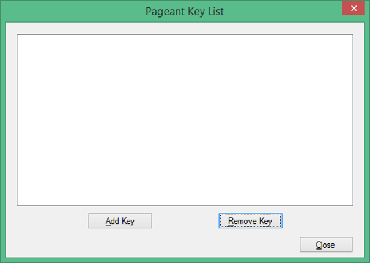

Accessing an Instance using SSH
===============================

Accessing an Instance
---------------------
There are several ways to access an instance. This largely depends on the operating system of the instance and also on the client operating system accessing the instance.

**Prerequisites**
**The following prerequisites must be fulfilled before accessing an instance over SSH**:

* The following network related tasks must be completed 

* subnet defined

* router defined for the subnet

* interface defined for the router

* instance is in a subnet using a router to the public network so it is reachable from outside

* Public key is uploaded to the cloud and assigned to the instance during the initial instance creation

* Floating IP has been associated to the instance

* TCP Port 22 (SSH) traffic is enabled to the instance in the security group that has been assigned to the instance

Accessing a Linux Instance using Pageant
^^^^^^^^^^^^^^^^^^^^^^^^^^^^^^^^^^^^^^^^

1) Verify that the private key of your keypair is in the .ppk format 
2) Open Pageant.

3) Press the **Add Key** button to add the private key (.ppk format) to Pageant (enter the passphrase if required).
4) The key should now be listed in Pageant.

.. image:: _static/access/fig2.png
                  :alt: Pageant Key List 

5) Press the **Close** button, Pageant will still run in the background.

6) Open the PuTTY application.   Put the Floating IP address in the Host Name field and click on “Open”.

.. image:: _static/access/fig3.png
                  :alt: PuTTY configuration 

				  
7) When prompted for a username – user the one you found in the Image Detail pane earlier in this exercise.    Hit Return.   You are now logged into your Linux instance.

.. image:: _static/access/fig4.png
                  :alt: Login 

				  
Accessing a Linux Instance with PuTTY (Manual Configuration)
^^^^^^^^^^^^^^^^^^^^^^^^^^^^^^^^^^^^^^^^^^^^^^^^^^^^^^^^^^^^
1) Open PuTTY.
2) Type in the Floating IP address in the Host Name field.   Then click on “Auth” in the Connection/SSH menu.

.. image:: _static/access/fig5.png
                  :alt: PuTTY configuration 

				  
3) Click on Browse, find your .ppk key and select it.   Then click on “Data” in the Connection menu.

.. image:: _static/access/fig6.png
                  :alt: PuTTY configuration Connection Data

				  
4) Type “cloud-user” into the “Auto-login username” field, then click on Open.

				  
5) The session window will now open.

				  
Accessing a Linux Instance via SSH Using a Keypair on Linux
^^^^^^^^^^^^^^^^^^^^^^^^^^^^^^^^^^^^^^^^^^^^^^^^^^^^^^^^^^^
When accessing an instance from a local Linux client via SSH, the private key file (.pem) must be stored in the Linux client and have the file permissions configured correctly to enable an SSH connection to the instance.   These permissions are configured when you create the key using ssh-keygen. If you use any other method for creating the key (Dashboard, PuTTY, etc) then you will need to ensure they are correctly copied to the Linux client and that they have the correct permissions.

1) Open a Terminal.

2) Connect to the instance via SSH using the keypair. The user is the local user of the instance which is defined in the image.

	ssh –i / *PrivateKeyPath/PrivateKeyFile UserOfTheInstance@IPaddress*

3) The command line connection has been established with the instance.

.. image:: _static/access/fig9.png
                  :alt: PuTTY configuration Connection Data

				  