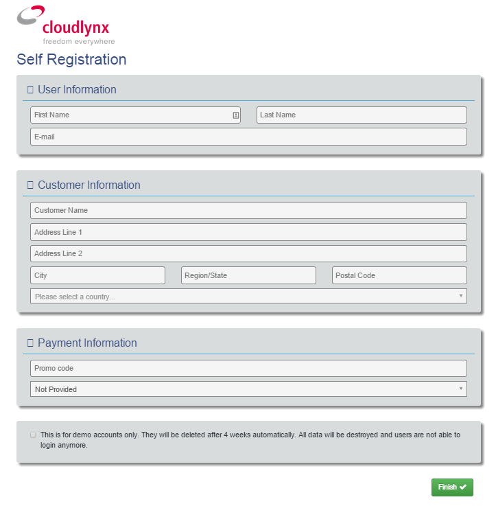
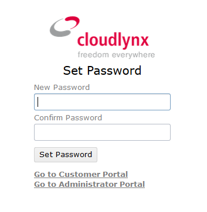
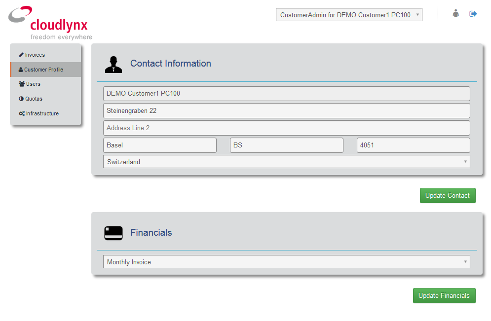
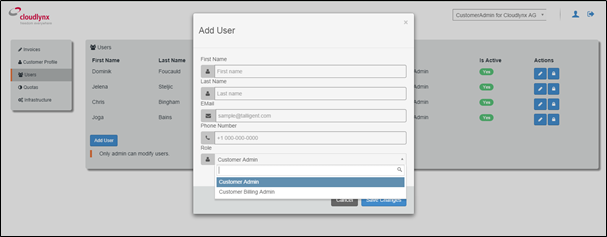
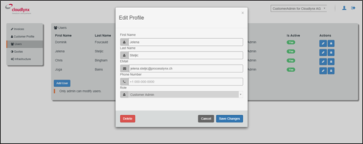
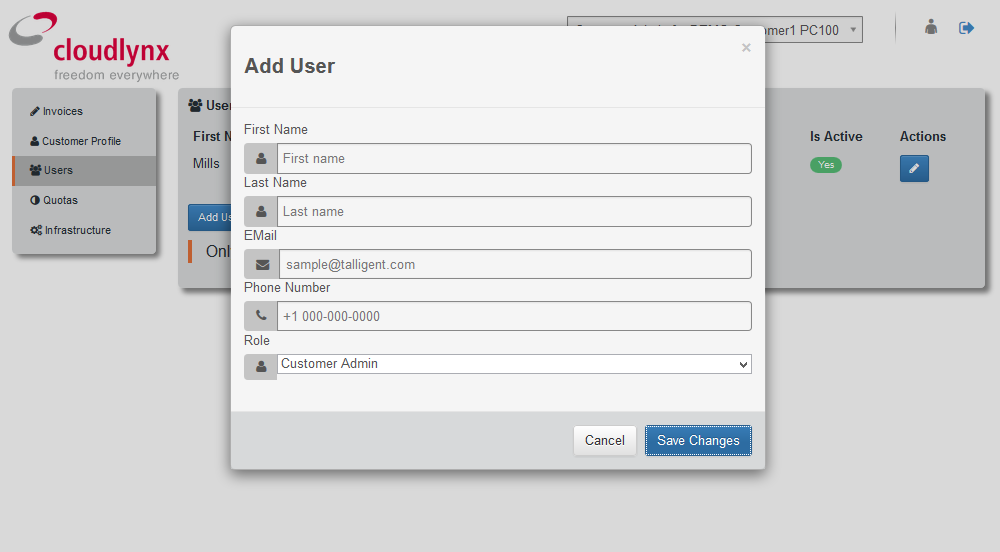

Account Management
==================

Introduction
------------

Welcome to the Cloudlynx Billing environment of the cloud! This document is designed to help cloud administrators and financial operators get started with Cloudlynx Billing environment. It can also act as a reference for daily operations.

The document covers the following topics how to: 

* Register for an account, 
* Track the current unbilled charge of the Cloud infrastructure, 
* View Invoices and process the payments,
* Request the quota change, 
* Edit your Company profile and manage users (add/edit/delete users)
* Get support and change support type. 

Before using the Cloudlynx Billing environment, we recommend reading this document to familiarise yourself with the system. 

**Note:** Account registered using the Cloudlynx Billing application will be used for accessing Cloudlynx Dashboard and the Cloudlynx Billing application. 

Registration
------------

To get started with Cloudlynx first you need to register. Registration process takes only few minutes. Registration involves a couple of steps including applying for an Account, providing contact information, and entering billing information as well.  

Create a Cloudlynx Account
^^^^^^^^^^^^^^^^^^^^^^^^^^

1. To sign up for an account click on the registration link provided on our website or go to https://preview.cloudlynx.ch/account/register

2. Registration page is opened containing the following:

  * **User Information** – enter basic User information data (e.g. first, last name, e-mail address).
  * **Customer Information** – enter basic Company information. During the registration process, your Account and Project are created in the Keystone. Your **Customer Name** will be used as a Project name in the Cloud.   
  * **Payment Information** – information related to payment method that will be used for paying the invoices. Available options: ‘PayPal’ or ‘Monthly Invoicing’. 
  **Note:** ‘**PayPal**’ – billing will be automatically via PayPal. PayPal authorization of the automatic payment of the invoice is needed. From the registration page, you’ll be redirected to the PayPal authorization page. ‘**Monthly Invoicing**’ - billing will be done by sending a monthly invoice in PDF format via e-mail notification. Authorization for monthly invoicing payment method is required. Cloudlynx administrators manually do this process. 

  ‘Promo Code’ is an optional field. The Cloudlynx provides promotional codes.  
  * **Terms and Conditions** - Before you processed with registration, please click on the link provided and read the Terms and Conditions. After you have read the Terms and Conditions, if you agree to them, check the box acknowledging that you accept the agreement, and continue with the account registration process. 

3. Click on the Finish button to send the registration data.

4. Notification e-mail will be sent to you as a confirmation that your registration for an account has been accepted. Cloudlynx administrators must authorize the registrations that have monthly invoicing payment method specified. Account authorization is a manual process. Once the authorization process is done, you will receive an e-mail to set a password for an account. Setup a password must be perform within period specified in an e-mail notification message.

Set a Password for an Account
^^^^^^^^^^^^^^^^^^^^^^^^^^^^^

To complete the Account registration, you need to set a password. Please click on the link provided in the e-mail notification sent by Cloudlynx. 

The following page will be displayed for setting a password:

   
1. Enter a new password. When creating your password it must meet the following requirements:

  * It must have at least 11 characters, 
  * It must not be based on a dictionary word,
  * Use combination of letters, capitalization, and other characters (number, special signs, punctuation, etc.) for the best results.
  
2. Confirm password by retyping the newly entered password.
3. Click on the Set Password button to finish setting the password.

Once the password is setup, the account is activated and ready for use. 

Account Registration post conditions
^^^^^^^^^^^^^^^^^^^^^^^^^^^^^^^^^^^^

An Account will not be created in the following cases:

* You are already registered with Cloudlynx service provider.
* PayPal billing is not authorized.
* Your Account has not been confirmed within specified period. An account will be removed from the system.

Manage an Account
-----------------

**Prerequisites:**

* Account is active. 
* User having Customer Admin role can edit account profile. 
* You are signed in the Cloudlynx Billing Dashboard. 

Edit Account
^^^^^^^^^^^^

To edit your Account Profile perform the following steps: 

1. Select the Customer Profile item on the side menu bar.
2. Edit Customer profile and payment page opens.
3. Editable fields for your profile are Company Name, Address, City, Postal Code, and Country.  
4. To change the payment method select the appropriate option from the dropdown list. 
5. Click on the Save Changes button to apply the changes. Click on the Cancel button to discard the changes

Close an Account 
^^^^^^^^^^^^^^^^

Only Cloudlynx Support can perform account closure.

1. Send a request via e-mail to the Cloudlynx for account closure. 
2. Your account will be disabled immediately after receiving a request for account closure. Your access is disabled and you are not able to login into the Cloudlynx Dashboard.
3. All resources which you had active are terminated and all data contained within are deleted. 
4. You will receive an e-mail notification about your account closure. 
5. The final invoice is generated as PDF document and sent to you via e-mail.  

Cloudlynx Billing Dashboard Overview
------------------------------------

After successfully logging into the Cloudlynx Billing Dashboard, you are directed to the **main** page.
The **Main** page provides an overview of the Cloudlynx billing tool. The content with the Invoices is displayed by default, showing the current charges, invoices list and payments made.  

The Billing dashboard is split into 3 sections:

* The side menu bar (left part of the screen)
* The content pane (middle part of the screen)
* The title bar (top part of the screen).

**Note:** Directions given in this document will use the definitions above. 

Side Menu Bar
^^^^^^^^^^^^^

The left section of the Cloudlynx Billing Dashboard is named the side menu bar. 

The side menu bar has the following menu structure:

* **Invoices** - provides information regarding Invoices, Payments and Current Charges for the usage of the Cloud infrastructure. 
* **Customer Profile** - provides basic customer and payment information.
* **Users** – used for managing users (add/modify/delete user, setting a password).     
* **Quotas** – used for requesting quota change for the Compute, Volume, Network resources. 
* **Infrastructure** - displays currently used resources in the Cloud.  

The Content Pane
^^^^^^^^^^^^^^^^

This section displays the main content. The shown content will vary depending on the topic selected from the side menu bar.

The Title Bar
^^^^^^^^^^^^^

The title bar can be found at the top of the page. It is always displayed independent of any selected topic.

* **Logged in as** - indicates which user account is currently logged in. 
* **Account Properties** – allows you to edit profile, change a password, logout. 
* **Sign Out** - logout from the current session.

Manage Users
------------

**Prerequisites** that must be fulfilled: 

* You as a Customer have an active account.
* User having customer admin role is logged in the Cloudlynx Billing application.

Customer administrator is allowed to:

* Register for an Customer Account, 
* Create a new Users,
* Modify User profiles,
* View Invoices (view current monthly unbilled charges, view monthly invoices and their status, process the payments),
* Requests Quota Changes,
* Utilizes Cloud resources.    

To Manage Users via Customer Dashboard:

1. Select the Users on the side menu bar.
2. List of Users is displayed with the following:

  * First Name 
  * Last Name 
  * E-mail
  * Role
  * Is Active
  * Actions (edit profile and change password options). 

3. Add User option allows creating and adding a new user to Customer (see chapter :ref:`create-user` for more information). 

.. _create-user:

Create a User
^^^^^^^^^^^^^

1. Select the Users on the side menu bar.
2. Click on the Add User button.
3. Enter all requested data.
4. Select a role for User from the list of options. 
5. Click on the Save Changes button to apply the changes. Click on the Cancel button to discard the changes. 

**Note:** For Customer’s Users the following roles are predefined:

* CustomerAdmin role;
* CustomerBillingAdmin role (limited access only to the Invoices).

Once the User has been added to the account, e-mail notification is sent to the User. Newly created User needs to set a password (see chapter 2.2 Set Password for an Account). 

Modify a User
^^^^^^^^^^^^^

1. Select the Users on the side menu bar.
2. For selected User click on the Edit Profile button in the Actions.
3. The Edit Profile dialog box opens.
4. Editable fields are: First Name, Last Name, E-mail and Phone Number. 
5. Click on the Save Changes button to apply the changes. Click on the Cancel button to discard the changes. 

   
Delete a User
^^^^^^^^^^^^^

1. Select the Users on the side menu bar.
2. For selected User click on the Edit Profile button in the Actions.
3. The Edit Profile dialog box opens. 
4. Click on the Delete button to delete user. Click on the Cancel button to discard the changes. 

Forgot a Password
^^^^^^^^^^^^^^^^^

If you forgot the password for the account, it can be easily reset. To reset a password, the following steps are required: 

1. Go to User login page for Cloudlynx Billing application.
2. Click on the ‘Forgot password?’ link.
3. Change Openbook password page is displayed.

   
4. Enter your username. 
5. Click on the Change Password button. Click on the Cancel button do discard the action.
6. If the username is valid, you will receive a password change link to the e-mail address associated with the account.
7. Click on the link provided in the e-mail notification.  
4. Enter a new password. When creating your password it must meet the following requirements:

  * It must have at least 11 characters, 
  * It must not be based on a dictionary word,
  * Use combination of letters, capitalization, and other characters (number, special signs, punctuation, etc.) for the best results.
  
8. Confirm password by retyping the newly entered password.
9. Click on the Set Password button to finish setting the password.

Change Infrastructure Quotas
----------------------------

You as a Customer can request a change in the Cloud usage quotas. Change of the infrastructure quotas is manual process, and approval of the quota change is needed. The Cloud administrators do approval manually. 

1. Select the Quotas on the side menu bar.
2. Change quotas for Compute, Volume and Neuron Network is displayed.
3. Select infrastructure item for which quota change will be requested.
4. Click on the Edit button. 
5. Use arrow up to request the increase of the quota, or arrow down to request decrease of the quota.
6. Click on the Request Change button to send request for approval. Click on the Cancel button to discard sending the request. 
7. Quota change status is “Request Pending”.  
8. Cloudlynx administrator reviews the request and approve/reject it. 
9. The quotas are increased as requested, or remain the same in a case of rejection.  
10. After approval process, you will get an e-mail notification about your quota change request either the quota request has been approved or rejected.  

**Important:** If a quota increase is requested, approval is needed from the Cloudlynx administrators. E-mail notification is sent containing the request for quota change. Cloudlynx administrator approves/rejects quota request. You will be informed about the quota change via e-mail. If you request a quota decrease, quota decrease is performed automatically without any additional approval from the Cloudlynx administrators side. You will be informed about the quota change via e-mail.

View Invoices
-------------

Usage of the Cloud resources are metered and billed. The Rate plan defined by the Cloudlynx service provider is applied to the metering information and an invoice (bill) is generated. 

The amount due for the bill is automatically collected via PayPal and credited to the reseller’s PayPal account. The bill is marked as paid.
 
If you had been approved for billing via e-mail, the bill is sent to you via e-mail as PDF attachment (file includes bank account details for making payment to the Cloudlynx service provider and the payment terms). The payment is made to the Cloudlynx bank account. The Cloudlynx account owner or administrator marks that bill as paid. 

To view Invoices via Cloudlynx Billing Dashboard:

1. Select the Invoices on the side menu bar.
2. The content pain se divided into tree panes:

  * Total Unbilled Charges is showing a current bill for the usage of the Cloud infrastructure services. 
  * Invoices is showing the list of invoices generated for each month containing the following: Invoice Number, Date of the invoice, Invoice Amount, Invoice Status (due, paid, overdue, etc.), and View option to preview the Invoice as PDF document. 
  * Payments is showing the list of all payments made. 
  
3. Click on the View button to preview the Invoice. Invoice is displayed in the PDF format. 

