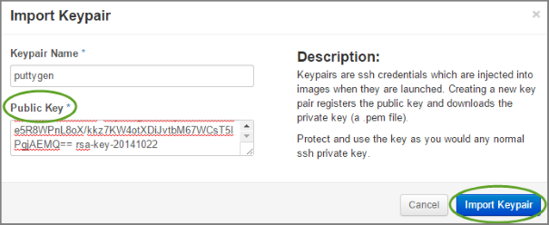
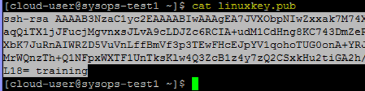
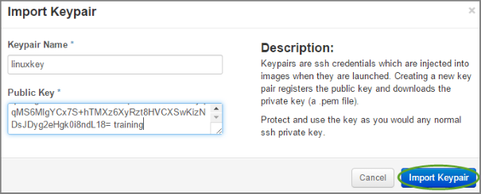

Keypairs
========

.. note::
      To access a Linux-based instance for the first time, it must be accessed using an SSH keypair. This applies to the Linux images provided by Cloudlynx only.

SSH keypairs are used to access instances securely without specifying a password each time. A keypair can be used for multiple instances that belong to the same project.

There are three possibilities how to create keypairs. It can be done either directly on the Cloudlynx dashboard by using a third party tool such as the open source tool PuTTYgen on a Windows client, or by using the CLI SSH commands of a Linux client.

How to Create a Keypair using PuTTY
-----------------------------------

1.  Open the **PuttyGen** software and click on **Generate**, you will then be prompted to, “Please generate some randomness by moving the mouse over the blank area.”   At this point just keep moving the mouse until you get the message, “Please wait while a key is generated”.

.. image:: _static/keypairs/fig1_puttygen.png
   :alt: Generating Key

.. image:: _static/keypairs/fig2_puttygen.png
      :alt: Generating Key

2.  Once the key is generated you will see it in the **Generator window**.
3.  Mark  everything in the large filed called “Public key for pasting into OpenSSH authorized_keys file” and copy it to the clipboard.

.. image:: _static/keypairs/fig3_puttygen.png
         :alt: Public Key

4.  Click on **“Save Private Key”** and follow the instructions. That is the key which is used later for the access over SSH.

Importing the Keypair
"""""""""""""""""""""

5.  The public key then has to be imported into the Dashboard. Click on **Access and Security**, then on Keypairs and finally on **Import Keypair**

.. image:: _static/keypairs/fig4_puttygen.png
               :alt: Access and Security

6.  In the **Public Key** field paste all of the characters that were created by the PuttyGen utility and click on **Import Keypair** (everything you see under point 2. In the large filed called “Public key for pasting into OpenSSH authorized_keys file”)

7.  If the import is successful you will see the following message

How to Create a Keypair on the Dashboard
----------------------------------------

.. note::
      The private key has been generated in the browser and there is no copy of the private key in the cloud nor is there a recovery option. The only existing copy is the one you have saved (the .pem file). Treat it like any other private key you may have and make sure not to lose it.

1. Select the **Access & Security** tab under the Manage Compute section in the sidebar.
2. Click on the **Keypairs** tab. All available keypairs for that project are listed. The list is empty by default until somebody creates or imports a keypair.
3. Click on the **Create Keypair** button.
4. Specify a name for the key. For example “Mills_Evan_Keypair”
5. Click on the **Create Keypair** button in the dialogue window.
6. The private key is available for download (the web browser may prompt you with download options). Cloudlynx will only store the public key in the project.
7. The keypair now appears on the list of available keypairs under **Access & Security > Keypairs**.

How to Create a Keypair using Linux
-----------------------------------

1.  Open a terminal and enter the following command and follow the instructions

        $ ssh-keygen –b 4096 –t rsa –C training

.. image:: _static/keypairs/fig1_linux.png
   :alt: Generating Keypair

2.  Add the SSH key to the ssh-agent using the ssh-add command

        $ ssh-add linux_keypair

3.  Depending on your linux server you may run into some errors when you run ssh-add, for example

.. image:: _static/keypairs/fig2_linux.png
   :alt: Error

4.  Should you get this error message run the following command (basically it is telling ssh-agent to open for communication)

        $ eval $(ssh-agent)

5.  Now try the ssh-add again

.. image:: _static/keypairs/fig3_linux.png
   :alt: ssh-add

6.  Cat the public key and copy the contents – all the contents (if you do not know where your key is stored use the following command to find it: $ sudo find / -name <name of your keypair>

Importing the Keypair
"""""""""""""""""""""

7.  Import the key using dashboard

.. image:: _static/keypairs/fig5_linux.png
   :alt: Dashboard

8.  Paste them into dashboard and click on Import Key

