Getting Started
===============

Introduction
------------

Welcome to the Cloudlynx cloud! This document is designed to help cloud administrators and system operators get started with the cloud environment. It can also act as a reference for daily operations.

The document covers the following topics:

* Compute instance (how to set up, launch and manage instances)
* Storage options (Block and object storage)
* Introduction to APIs and CLI
* Introduction to orchestration (automate the cloud infrastructure)

Before using the Cloudlynx cloud environment, we recommend reading this document to familiarise yourself with the system.

Additional training courses and course material are available on the Cloudlynx website: https://www.cloudlynx.ch

**Note:** This document assumes you have an active Cloudlynx account.

Cloudlynx Dashboard
-------------------

The Cloudlynx dashboard serves as the starting point when accessing the Cloudlynx graphical user interface (GUI). It provides an overview of the current cloud resources being used, as well as listing the cloud services offered by Cloudlynx.

Log in to the Cloudlynx Dashboard
^^^^^^^^^^^^^^^^^^^^^^^^^^^^^^^^^

To log in to the Cloudlynx dashboard, use the link provided in the welcome email or use the login link on the Cloudlynx webpage. The login credentials are provided during the registration process.

.. image:: _static/gettingstarted/fig1.png
   :alt: Log In window

**Note:** The registration process is not covered in this document. For more information, please visit https://www.cloudlynx.ch/en/registration.

**Note:** In the case of a forgotten password, please go to the account management site https://preview.cloudlynx.ch/account.

Overview of the Cloudlynx Dashboard
^^^^^^^^^^^^^^^^^^^^^^^^^^^^^^^^^^^

After successfully logging in to the Cloudlynx dashboard, you will be directed to the **Overview** page.
The **Overview** page provides an overview of the cloud resources: applied limits, currently used cloud resources, as well as providing the possibility to query cloud usage from the past.

The Cloudlynx dashboard is split into 3 sections:

* The side bar (left part of the screen)
* The content pane (middle part of the screen)
* The title bar (top part of the screen)

.. image:: _static/gettingstarted/fig2.png
   :alt: Dashboard Overview

**Note:** Directions given in this document will use the definitions above.

The Side Bar
""""""""""""
The left section of the Cloudlynx dashboard is called the side bar. Here, you will find a list of the cloud services that Cloudlynx provides as well as your current project.

The side bar has the following menu structure:

**Manage Compute**

* Overview:	provides an overview of the current resource usage
* Instances: create, launch and manage instances
* Volumes: create, attach and manage persistent block storage
* Images & Snapshots: create, upload and manage images and snapshots
* Access & Security: configure security of and access to instances 

**Manage Network**

* Network Topology: provides a graphical overview of the network setup
* Networks: create and configure virtual networks, subnets, gateways, IP allocations
* Routers: create, configure and connect routers to virtual networks

**Object Store**

* Containers: create, upload and manage persistent object storage
	
**Orchestration**

* Stacks: execute automatic deployment of a whole cloud setup (including compute, block storage, object storage, network etc.)

**Note:** The Red Hat tab forwards you to the Red Hat Customer Portal. This feature should not be used, as it will be removed in future updates. A Red Hat account or subscription is required for accessing this section.

The Content Pane
""""""""""""""""

This section displays the main content. The shown content will vary depending on the topic selected from the side bar.
On the **Overview** page you are able to query current and past cloud usage, as well as export the results. This can be done by selecting a **From:** and **To:** date and pressing **Submit**. The results are then displayed.

**Note:** The Date format needs to be YYYY-MM-DD.

.. image:: _static/gettingstarted/fig3.png
   :alt: Select a period of time to query its usage

A usage summary report can be exported into CSV format. Click on the **Download CSV Summary** button to generate the file.

.. image:: _static/gettingstarted/fig4.png
   :alt: Download CSV Summary
   
The Title Bar
"""""""""""""

The title bar can be found at the top of the page and is always displayed independent of any selected topic.

* Logged in as: indicates which user account is currently logged in 
* Settings: change language, time zone, items per page shown and password
* Help: opens the official documentation of OpenStack
* Sign Out: log out of the current session

Change Password
"""""""""""""""
A password change should not be done via the **Settings** link in the title bar. Instead please go to the account management site https://preview.cloudlynx.ch/account. Log in with your credentials, click on the user icon in the upper right hand corner and select **Change Password**. 

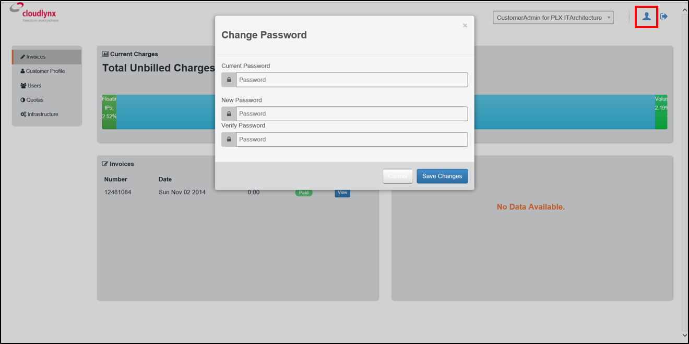

.. _key-management:

Key Management
--------------

SSH keypairs are used to access instances securely without specifying a password each time. A keypair can be used for multiple instances that belong to the same project.

**Note:** To access a Linux-based instance for the first time, it must be accessed using an SSH keypair. This applies to the Linux images provided by Cloudlynx only.

.. _create-keypair:

Create a New Keypair
^^^^^^^^^^^^^^^^^^^^

There are three possibilities how to create keypairs. It can be done either directly on the Cloudlynx dashboard by using a third party tool such as the open source tool PuTTYgen on a Windows client, or by using the CLI SSH commands of a Linux client.

On the Dashboard
""""""""""""""""

1. Select the **Access & Security** tab under the Manage Compute section in the sidebar.
2. Click on the **Keypairs** tab. All available keypairs for that project are listed. The list is empty by default until somebody creates or imports a keypair.
3. Click on the **Create Keypair** button.
4. Specify a name for the key. For example “Mills_Evan_Keypair”
5. Click on the **Create Keypair** button in the dialogue window.
6. The private key is available for download (the web browser may prompt you with download options). Cloudlynx will only store the public key in the project.
7. The keypair now appears on the list of available keypairs under **Access & Security > Keypairs**.

**Note:** The private key has been generated in the browser and there is no copy of the private key in the cloud nor is there a recovery option. The only existing copy is the one you have saved (the .pem file). Treat it like any other private key you may have and make sure not to lose it. 

.. image:: _static/gettingstarted/fig6.png
   :alt: Create Keypair

With a Key Generator on a Local Windows Client
""""""""""""""""""""""""""""""""""""""""""""""

1. Get a key generator. We use the free open source tool **PuTTYgen** as an example (www.putty.org).
2. Start **PuTTYgen** and click on the **Generate** button and follow the instructions.
3. Optionally, you can change the comment under **Key comment** for easier identification of the key. For extra protection you may also add a phrase under **Key passphrase**.
4. For more security, change the field **Number of bits in a generated key** from 2048 to 4096.
5. Click on the **Save private key** button and it will be saved as a .ppk file.
6. Click on the **Save public key** button to save it in a file for further usage.
7. To import the keypair to the dashboard, copy the text from the field **Public key for pasting into OpenSSH authorized keys file** to your clipboard.
8. Continue with section Import an Existing Keypair.

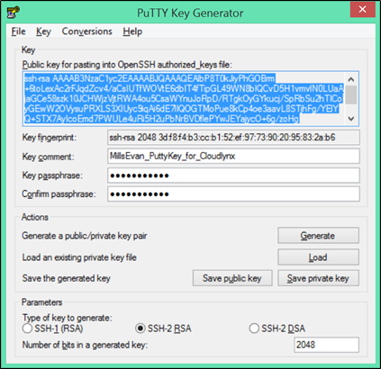

On a Local Linux Client
"""""""""""""""""""""""

To create a keypair on a Linux client, follow the steps below:

1. Open a **Terminal**.
2. Enter the **ssh-keygen** command to start the SSH key creation. Replace the variables in the examples below with your variables::

	$ ssh-keygen -b 4096 -t rsa -C Keypair_for_Cloud_Company_Instances 
    Generating public/private rsa keypair.

**Note:** Recommended options to be used when creating the SSH key are (they are case sensitive):

* -b (set the bitrate of the key) 4096 for RSA and 1024 for DSA
* -t (set the type of the key) RSA or DSA
* -C (add a comment to the key) information to identify the key

3. Enter the **keyname**.::

    Enter file in which to save the key (/filepath/.ssh/id_rsa): keyname

4. Enter the **passphrase** for the key (this is optional but is more secure).::
	
    Enter a passphrase (empty for no passphrase): passphrase
    Enter the same passphrase again: passphrase

5. The SSH key is being generated and will placed both private and public key into your .ssh file.::

    Your identification has been saved in Cloud_Instance.
    Your public key has been saved in Cloud_Instance.pub.
    The key fingerprint is:
    40:fc:bd:cd:4f:c0:bf:e5:e6:89:47:c8:9a:54:2c:9e Keypair_for_Cloud_Company_Instances
    The key's randomart image is:
    +--[ RSA 4096]----+
    |     ..          |
    |     ..          |
    |      .. . ..    |
    |       .. ..oo   |
    |        S .+=o.  |
    |          .Eooo..|
    |          . oo.+ |
    |            o +.+|
    |             ..+.|
    +-----------------+
    $

6. Add the SSH key to the ssh-agent using the ssh-add command.::

    $ ssh-add /filepath/privatekeyname

Import an Existing Keypair
^^^^^^^^^^^^^^^^^^^^^^^^^^

A keypair can be generated with an external tool that creates OpenSSH formatted keys (see section :ref:`create-keypair`). Any type of an OpenSSH key is accepted.

1. Select the **Access & Security** tab on the side bar under the **Manage Compute** section.
2. Click on the **Keypairs** tab. 
3. Click on the **Import Keypair** button.
4. In the **Keypair Name** field, specify a name for identification purposes. 
5. Copy and paste the content of the public key into the **Public Key** field.
6. Click on the **Import Keypair** button to finish.

**Note:** The private key is never seen by the cloud system and is only ever held by the customer. This option is the most secure one.

**Note:** An error message may occur if the format of the key is not OpenSSH.

Translate non-OpenSSH key to OpenSSH
^^^^^^^^^^^^^^^^^^^^^^^^^^^^^^^^^^^^

1. Download and open **PuTTYgen**. 
2. Click on the **Load** button.
3. Choose the private key file. In Windows environment, change the filter to **All Files (*.*)** if the file is not displayed.
4. Once the key is open, the text in the field **Public key for pasting into OpenSSH authorized keys file** can now be copied and used for the import dialogue on the dashboard.

Delete a Keypair
^^^^^^^^^^^^^^^^

**Warning:** Instances may not be accessible anymore if the public key is deleted.

1. Select the **Access & Security** tab on the side bar under the **Manage Compute** section.
2. Click on the **Keypairs** tab. All available keypairs for that project are listed.
3. Click on the checkbox on the left of the keypair to be deleted.
4. Click on the **Delete Keypair** button.

**Note:** This action cannot be undone.

**Note:** This will delete the public key on the system. The private key is not affected.

Networks
--------

Cloudlynx provides a scalable, pluggable and API-driven system for managing network connectivity and IP addresses. It allows users to create their own networks and control the traffic. 

Create a Network
^^^^^^^^^^^^^^^^

1. Select the **Networks** sub-menu item under the **Manage Network** section on the side bar.
2. Click on the **Create Network** button.

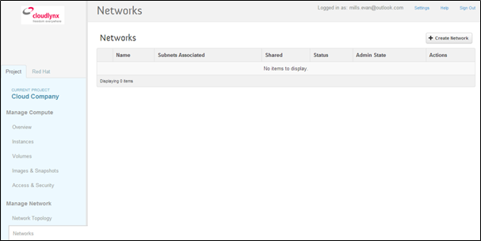
   
3. The dialogue window which appears consists of the tabs **Network**, **Subnet** and **Subnet Detail**. 

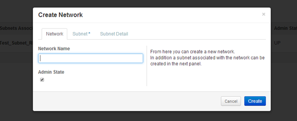

4. Specify a name to identify the network in the **Network Name** field.
5. **Admin State** field – checked by default. If check box is empty, it means the network is down and will not forward packets.
6. Click on the **Subnet** tab.
7. Uncheck the **Create Subnet** checkbox if a subnet is not specified when the network is created.
8. Click on the **Create** button in the dialogue window.
9. The network is created.
10. The network now appears in the list of networks under **Manage Network > Networks**

**Note:** A subnet must be specified to be able to launch an instance (see :ref:`subnets`)

Edit a Network
^^^^^^^^^^^^^^

1. Select the **Networks** tab on the side bar under the **Manage Network** section.
2. Click on the **Edit Network** button on the network that needs to be edited.
3. Editable fields are **Network Name** and **Admin State**.
4. Click on the **Save Changes** button to save changes.

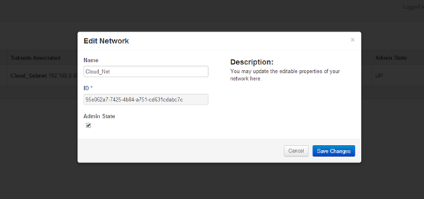

Delete a Network
^^^^^^^^^^^^^^^^

1. Select the **Networks** tab on the side bar under the **Manage Network** section.
2. Mark the checkboxes of the networks to delete.
3. Click on the **Delete Networks** button.

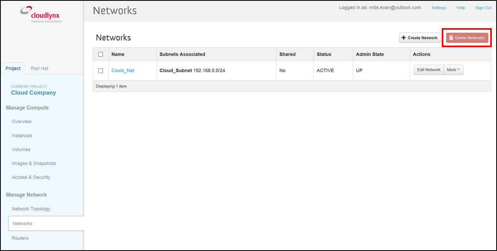

**Warning:** Make sure that there are no instances attached to the network you want to delete.

.. _subnets:

Subnets
-------

.. _create-subnet:

Create a Subnet
^^^^^^^^^^^^^^^

1. Select the **Networks** sub-menu item under the **Manage Network** section.
2. Click on the **Network name** from the list of all **Networks** for which subnet needs to be defined.
3. Click on the **Create Subnet** button. 
4. Specify a name for the subnet.
5. Specify the IP address for the subnet (e.g. 192.168.0.0/24).
6. Select **IP version**: IPv4 or IPv6 (IPv6 currently not applicable).
7. Specify a **Gateway IP** address. This parameter is optional. If this field is left blank, the system will automatically take the first address of the defined subnet IP range (e.g. 192.168.0.1).
8. **Disable Gateway** checkbox – select this check box in order to disable the gateway. 

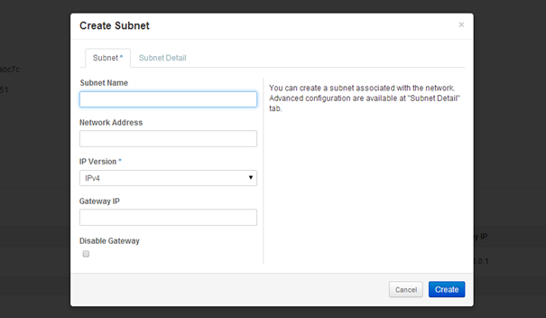

**Note:** A subnet represents an IP address block that can be used to assign IP addresses to virtual instances. Each subnet must have a Classless Inter-Domain Routing (CIDR) address and must be associated to a network. IP addresses can be either selected from the whole subnet CIDR or from allocation pools that can be specified by the user.

**Note:** A subnet can also optionally have a gateway, a list of DNS name servers, and host routes. This information is pushed to instances whose interfaces are associated with the subnet. 

9. Go to the **Subnet Detail** tab in order to define additional attributes for the subnet (all optional).
10. Mark the **Enable DHCP** checkbox to enable DHCP.
11. Specify IP address allocation pools.
12. Specify a name for the DNS Server. 
13. Specify the IP address of the host routes.
14. Click on the **Create** button to finish the creation of the additional attributes for the subnet.

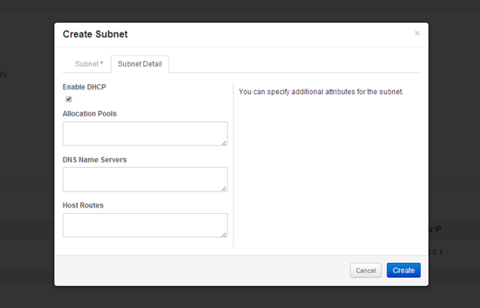
   
Edit a Subnet
^^^^^^^^^^^^^

1. Select **Network Topology** on the side bar under the **Manage Network** section. 
2. Click on the name of the network to get the **Network Detail** page.
3. Details about the network, subnets and ports of the selected network are displayed.
4. Click on the **Edit Subnet** button.
5. The **Update Subnet** dialogue box opens. 
6. Under the **Subnet** tab the editable fields are: **Subnet Name** and **Gateway IP** (optional).

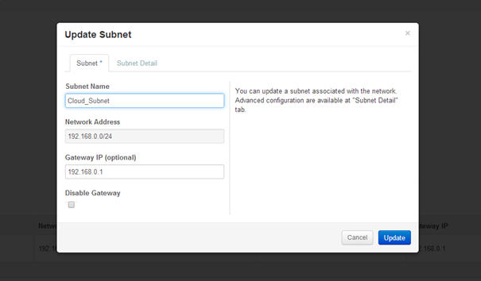
   

7. Under the **Subnet Detail** tab the editable fields are:

  * **Enable DHCP** – Select this checkbox to enable DHCP.
  * **DNS Name Servers** – Update the name of the DNS server.
  * **Host Routes** – Update the IP address of the host routes.

8. Click on the **Update** button to save any changes.

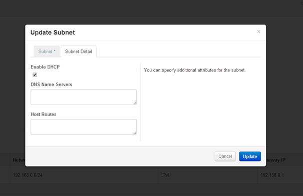

Delete a Subnet
^^^^^^^^^^^^^^^

1. Select **Network Topology** on the left side bar under the **Manage Network** section. 
2. Click on the name of the network to get the **Network Detail** page.
3. Details about the network, subnets and ports of the selected network are displayed.
4. Under the section **Subnets**, mark the subnets that need to be deleted.
5. Click on the **Delete Subnets** button.
6. Confirm the deletion of subnets by clicking on the **Delete Subnets** button.

**Note:** This action cannot be undone.

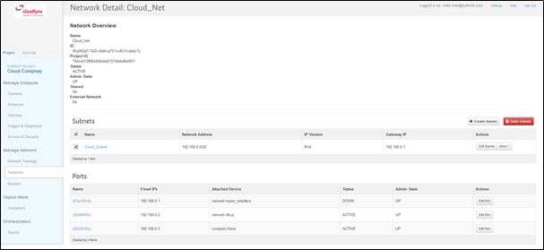
   
Routers
-------

A router is needed to establish a connection between subnets or to connect a subnet to the public network so that the instances can be reached over the internet.

Create a Router
^^^^^^^^^^^^^^^

1. Select the **Routers** tab on the side bar under the **Manage Network** section.
2. Click on the **Create Router** button. 
3. In the **Create Router** dialogue box, specify a name for the router.
4. Click on the **Create Router** button. The new router is now displayed in the **Routers** tab.

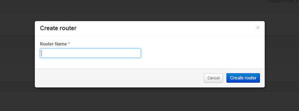

Set a Gateway
^^^^^^^^^^^^^

1. Select the **Routers** tab on the side bar under the **Manage Network** section.
2. Click on the **Set Gateway** button for the router you want to set a gateway for.
3. In the **External Network** field, specify the network to which the router will connect (this is normally the public network, which is a connection to the Internet).
4. Click on the **Set Gateway** button.

.. image:: _static/gettingstarted/fig18.png
   :alt: Set Gateway

	
^^^^^^^^^^^^^^^^^^^^^^^^^^^^^^^^^^^^^

1. Select the **Routers** tab on the side bar under the **Manage Network** section. 
2. Click on the name of the router.
3. On the **Router Details** page, click on the **Add Interface** button.
4. In the **Add Interface** dialogue box, select a subnet from the **Subnet** dropdown list.
5. Enter the router interface **IP address** for the selected subnet. 
6. Click on the **Add Interface** button to finish.

**Note:** If the IP address value is not set, either the default gateway IP address or the first host IP address in the subnet is used by default. 

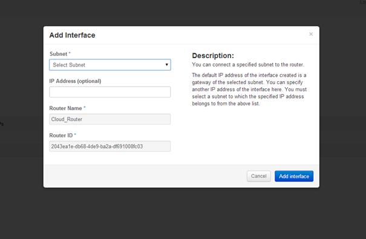
   
Delete a Router
^^^^^^^^^^^^^^^

1. Select the **Routers** tab on the side bar under the **Manage Network** section.
2. Mark the checkboxes of the routers that need to be deleted.
3. Click on the **Delete Routers** button.
4. Confirm the action by clicking on the **Delete Routers** button. 

**Note:** This action cannot be undone. 

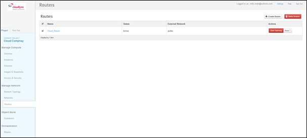

Network Topology
----------------

The **Network Topology** page represents a graphical overview of the created networks.
The following buttons are available at the top of the **Network Topology** page:

* Launch Instance
* Create Network
* Create Router

There are also two buttons called **Small** and **Normal**. Those will change the view of the network topology, to either give you more space if you have a lot of networks (**Small**) or show you more details (**Normal**) including IP addresses and names.

Hover over **Instance** and **Router** icons to see the details and also to perform certain actions, for example:

* Terminate an instance
* View instance details
* Open the console
* Delete a router
* Delete an interface

By clicking on the network name the **Network Detail** page will be opened, showing a network overview, related subnets and ports.

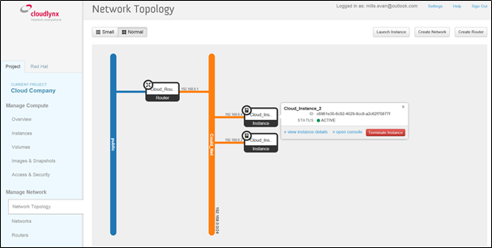

View Network Detail
^^^^^^^^^^^^^^^^^^^

1. Select **Network Topology** on the side bar under the **Manage Network** section. 
2. Click on the name of the network you want to know more about.
3. The **Network Overview** page of the selected network is displayed.

From the **Network Overview** page it is possible to create, edit or delete a subnet, as well as to edit ports. (For more information how to create a subnet see :ref:`create-subnet`). 

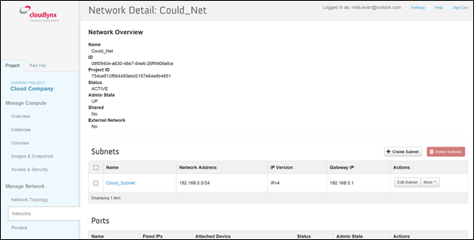
   
Edit a Subnet
^^^^^^^^^^^^^

1. Select **Network Topology** on the side bar under the **Manage Network** section. 
2. Click on the name of the network to view the **Network Detail** page.
3. Click on the **Edit Subnet** button of the subnet you want to edit.
4. The **Update Subnet** dialogue box is opened. Under the **Subnet** tab the editable fields are: **Subnet Name** and **Gateway IP** (optional).

5. Under the **Subnet Detail** tab the editable fields are:

  * **Enable DHCP** – Select this check box to enable DHCP.
  * **DNS Name Servers** – Update the name for the DNS server.
  * **Host Routes** – Update the IP address of host routes.

  6. Click on the **Update** button to save changes.

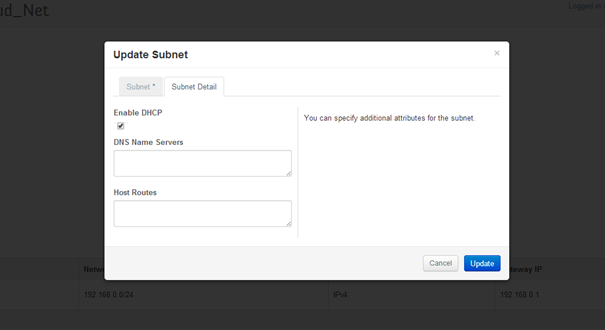
   
Delete a Subnet
^^^^^^^^^^^^^^^

1. Select **Network Topology** on the side bar under the **Manage Network** section. 
2. Click on the name of the network to view **Network Detail**.
3. On the **Network Detail** page, mark the subnets that need to be deleted.
4. Click on the **Delete Subnets** button on the upper right.
5. Confirm the action by clicking on the **Delete Subnets** button.

**Note:** This action cannot be undone.

   
Configure and Manage Security
-----------------------------

Before launching an instance, the security group rules should be configured to select which types of traffic instances are able to send and receive.

Security Groups
^^^^^^^^^^^^^^^

A **Security Group** is a named collection of firewall rules which are used to limit the types of traffic that can be send from or received by a particular instance or group of instances. An instance can have one or more security groups assigned. 

The default security group and a newly created security group have some predefined firewall rules:

* Default security group – allows all outgoing traffic to anywhere on IPv4 and IPv6. Allows incoming traffic from other default security group instances
* Unmodified new security group – allows all outgoing traffic to anywhere on IPv4 and IPv6

Create a Security Group
"""""""""""""""""""""""
1. Click on the **Access & Security** sub-menu item under the **Manage Compute** section.

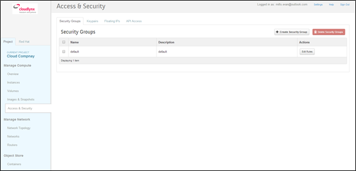

2. Click on the **Create Security Group** button.
3. The **Create Security Group** pop-up window is displayed.

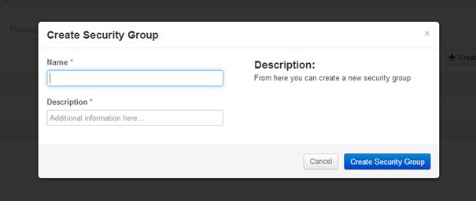
   
4. Specify a name for the security group under **Name**.
5. Add a description for the security group under **Description**.
6. Click on the **Create Security Group** button.

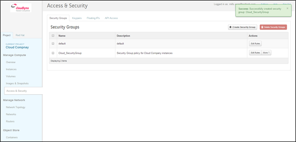

7. The new security group appears in the list under **Security Groups**.

Delete a Security Group
"""""""""""""""""""""""

To delete a security group, proceed as follows:

1. Click on the **Access & Security** sub-menu item under the **Manage Compute** section.
2. In the **Security Group** tab, click the **Security Group** to be deleted. 
3. Click on the **Delete Security Groups** button. 
4. Confirm the security group deletion by clicking on the **Delete Security Groups** button.

**Note:** The security group cannot be deleted as long as it is being used for one or more instances.

**Note:** The deletion of a security group cannot be undone.

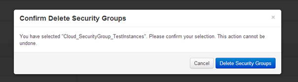
   
Security Group Rules
^^^^^^^^^^^^^^^^^^^^

Modify the rules in a security group to allow access to instances through different ports and protocols. 

The following parameters for rules must be specified:

* **Destination Port On Instances** – Define a port range. To open a single port, enter the same value twice. The Internet Control Message Protocol (ICMP) does not support ports; enter values to define the codes and types of ICMP traffic to be allowed instead. 
* **Source of Traffic** – The source can be defined either as an IP address, an IP address range, or as another security group in the cloud.

**Note:** Rules are automatically enforced for that security group as soon as you create or modify them. This takes effect on the instances that have the security group assigned to it.

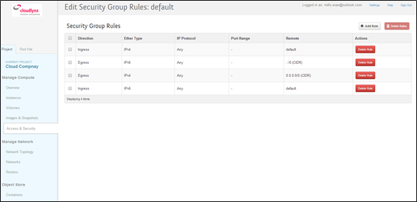

Add a Rule to the Default Security Group
""""""""""""""""""""""""""""""""""""""""

For example, to enable only SSH and ICMP (Internet Control Message Protocol), ping access to instances and block all other traffic.

1. Click on the **Access & Security** sub-menu item under the **Manage Compute** section.
2. In the **Security Group** tab, click the **Edit Rules** button on the default security group.

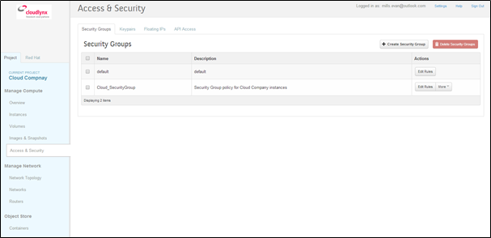

3. Click on the **Add Rule** button. 
4. The **Add Rule** pop-up window is displayed.

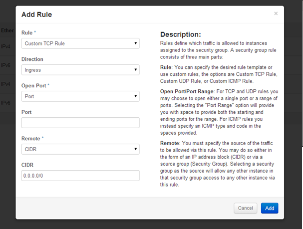

* **Rule** – Select the desired rule template or use custom rules from the **Rule** dropdown list. 
* **Direction** – Select the direction from the dropdown list. 
* **Open Port** – Define the port or ports to which the rule will apply using the **Open Port** field. 
  
  * **Port** – Define a specific port in the **Port** field.
  * **Port Range** – Define the port range using the **From Port – To Port** fields.
  
* **Remote** – Specify the source of the traffic to be allowed via this rule.

  * **CIDR** – Define the source of the traffic in the form of an IP address block.
  * **Security Group** – Selecting a security group as the source will allow any other instance in that security group access to any other instance with the source of traffic defined via security group.

5. Click on the **Add** button to add the new rule to the security group.
6. The rule is successfully added to a security group. 

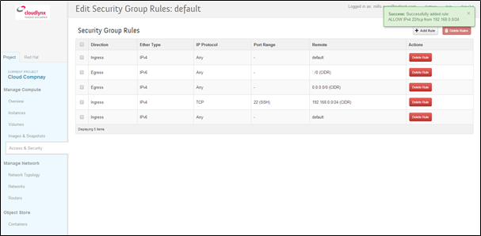
   
**Note:** Once a rule is created, it cannot be edited later. If a rules needs to be changed, it needs to be deleted and created as a new rule with new parameters.

Delete a Rule
"""""""""""""

1. Click on the **Access & Security** sub-menu item under the **Manage Compute** section.
2. In the **Security Group** tab, click the **Edit Rules** button.
3. Mark the checkboxes of the rules to be deleted.
4. Click on the **Delete Rules** button.
5. Confirm the rule deletion by clicking on the **Delete Rules** button. 

**Note:** This action cannot be undone. 

Floating IPs
^^^^^^^^^^^^

Each launched instance has a private IP address and can also have a public (floating) IP address. The private IP address is used for communication between instances, and the public address is used for communication with networks outside the cloud, including the Internet.

Request a New Floating IP
"""""""""""""""""""""""""

To add a new floating IP to your project, proceed as follows:

1. Click on the **Access & Security** sub-menu item under the **Manage Compute** section.
2. Click on the **Floating IPs** tab.

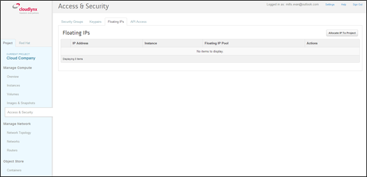
   
3. Click on the **Allocate IP to Project** button.
4. An **Allocate Floating IP** pop-up window is displayed.

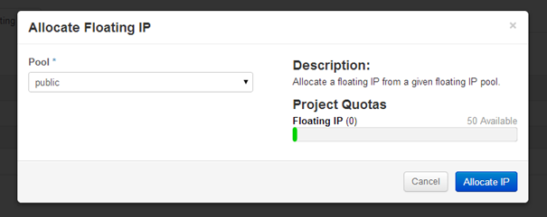
   
5. Click on the **Allocate IP** button to add a new floating IP to the floating IP pool.

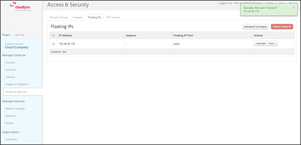
   
6. A new floating IP is available in the **Floating IPs** list under **Manage Compute > Access & Security**.

Associate a Floating IP to an Instance
""""""""""""""""""""""""""""""""""""""

1. Click on the **Access & Security** sub-menu item under the **Manage Compute** section. 
2. Click on the **Floating IPs** tab. 
3. In the **Floating IPs** list click on the **Associate** button. The **Manage Floating IP Associations** pop-up window is displayed.

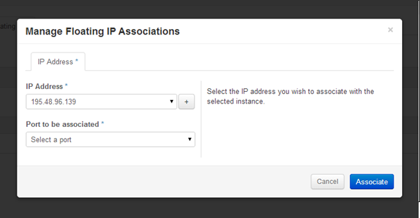
   
4. The floating IP chosen is automatically filled into the **IP Address** field. 

  * A new IP address can be added by clicking the + button. This option will add a new Floating IP to your floating IP pool.
  * Another IP address can be selected also by opening the dropdown menu and selecting an alternative IP address from the pool of available IP addresses to your project.

5. Click on a port in the **Port to be associated** dropdown menu to associate it with the floating IP. The list shows all the instances with their fixed IP addresses. 

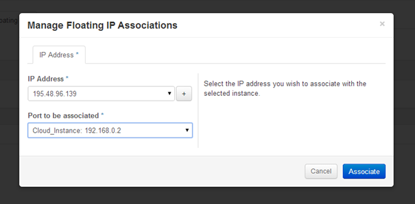
   
6. Click on the **Associate** button. 
7. The IP address will be associated to the instance.

.. image:: _static/gettingstarted/fig39.png
   :alt: Access & Security – successfully associated floating IP to an instance
   
Disassociate a Floating IP Address from an Instance
"""""""""""""""""""""""""""""""""""""""""""""""""""

1. Click on the **Access & Security** sub-menu item under the **Manage Compute** section. 
2. Click on the **Floating IPs** tab.
3. Click on the **Disassociate** button of the floating IP address to be disassociated from an instance.
4. The **Confirm Disassociate** pop-up window is displayed.
5. Click on the **Disassociate** button to finalise the action.

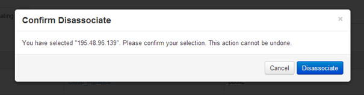
   
6. The floating IP address is successfully disassociated from the instance.

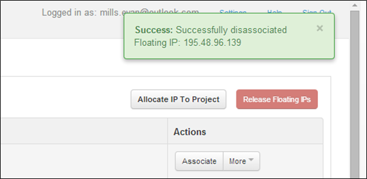
   
Release a Floating IP
"""""""""""""""""""""

To release a floating IP address, proceed as follows:

1. Click on the **Access & Security** sub-menu item under the **Manage Compute** section. 
2. Click on the **Floating IPs** tab. 
3. In the **Floating IPs** list, mark the checkboxes of the IP addresses to be released.
4. Click on the **Release Floating IPs** button.
5. The **Confirm Release Floating IPs** pop-up window is displayed.

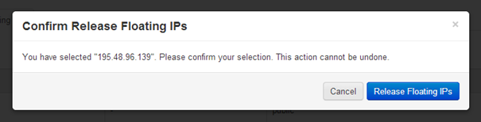
   
6. Click on the **Release Floating IPs** button to finalise the release.

.. image:: _static/gettingstarted/fig43.png
   :alt: Access & Security – successfully released floating IP
   
Launch an Instance
------------------

Cloudlynx provides multiple methods to launch an instance, ranging from the GUI based dashboard, Command Line Interface and API commands to orchestration templates.

**Note:** To launch an instance the following prerequisites must be fulfilled:

* The person launching the instance must have the correct login details for the account.
* The network is correctly defined and includes at least one subnet.

Instances can be launched from the following screens:

* **Manage Compute > Instances**
* **Manage Compute > Images & Snapshots**
* **Manage Network > Network Topology**

This document will cover the following options in detail:

* Boot from an image
* Boot from a snapshot
* Boot from a volume

.. _launch-instance-dashboard:

Launch an Instance from the Dashboard
^^^^^^^^^^^^^^^^^^^^^^^^^^^^^^^^^^^^^

To launch an instance via the Cloudlynx dashboard:

1. Select the **Instances** sub-menu item under the **Manage Compute** section on the side bar.

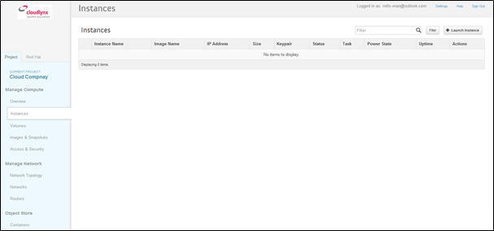
   
2. Click on the **Launch Instance** button on the top right. The **Launch Instance** pop-up window is displayed.

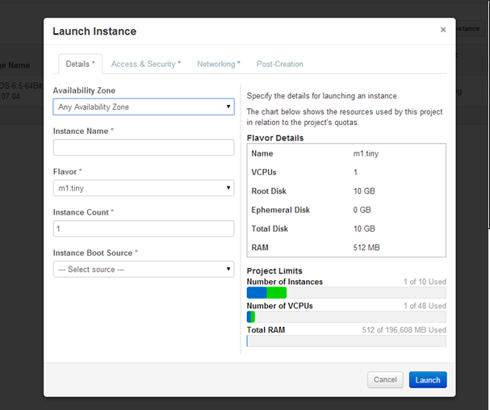
   
3. Select an availability zone for the instance from the dropdown list. This defines where the instance will be physically located.
4. Fill out the **Instance Name** field to give the instance a unique name for easy identification.
5. Select a flavour for the instance. Flavours are predefined and determine the compute resources available. For the selected flavour, the resources are displayed in the **Flavor Details** section on the right.
6. To launch multiple instances, enter a value greater than one in the **Instance Count** field.
7. Select the **Instance Boot Source** from the dropdown list and fill out the additional fields depending on the boot source chosen.

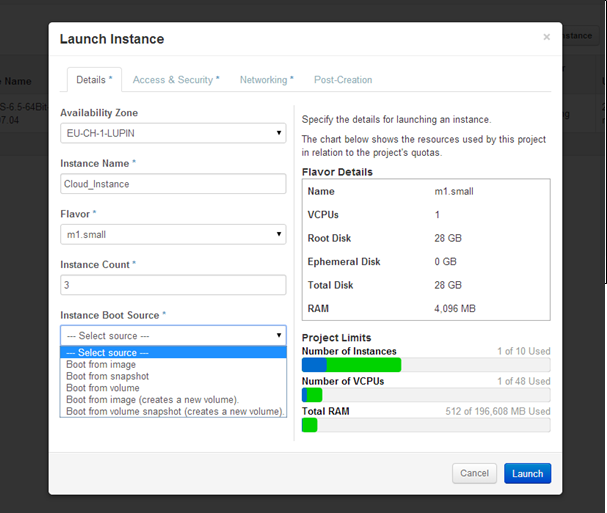
   
The Instance Boot Sources are:

* **Boot from image** – A new field for **Image Name** displays. Select an image from the list.
* **Boot from snapshot** – A new field for **Instance Snapshot** displays. Select a snapshot from the list.
* **Boot from volume** – A new field for **Volume** displays. Select a volume from the list.
* **Boot from image (creates a new volume)** – Boot from an image and create a volume by entering the device size and device name for your volume. Select the **Delete on Terminate** option to delete the volume on terminating the instance.
* **Boot from volume snapshot (creates a new volume)** - boot from a **volume snapshot** and create a new volume by choosing **Volume Snapshot** from the list and adding a **Device Name** for your volume. Click the **Delete on Terminate** option to delete the volume on terminating the instance.

**Note:** Please see the relevant chapters for more information on how to create and upload those boot sources (e.g. chapter Volume for creating a volume and a snapshot of a volume).

8. Click on the **Access & Security** tab.
9. Select an existing keypair from the dropdown list or click on the + button to upload a new keypair (See chapter :ref:`key-management` for more information).
10. Specify **Admin Pass** if launching a Windows-based instance.

**Note:** **Admin Pass** is currently an untested feature. The Cloud-init package is required to use this feature.

11. Select the security groups to be used for the instance. The **default** box under **Security Group** is checked by default (See chapter 8 Configure and Manage Security for more information). Multiple security groups can be chosen.

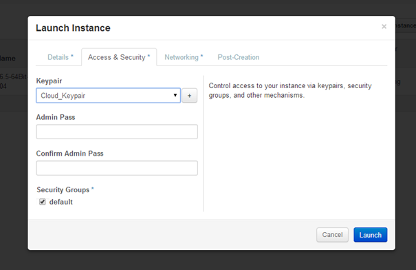
   
12. Click on the **Networking** tab.
13. Select a network from the **Available networks** list. Either by clicking on the blue **+** button for the relevant network or by dragging and dropping the network from the **Available networks** to the **Selected Networks** field.

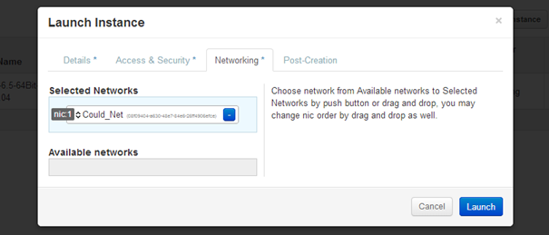
   
**Note:** Several networks can be added to the same instance.

14. The **Post-Creation** tab allows to use scripts (for example Bash) that can be run after launching an instance or instances

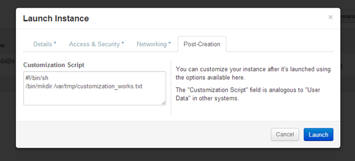

15. Click on the **Launch** button to launch the instance.
16. To check the status of the instance, select the **Instances** sub-menu item under the **Manage Compute** section.
17. Once the instance is up and running, the status will change to **Active**.

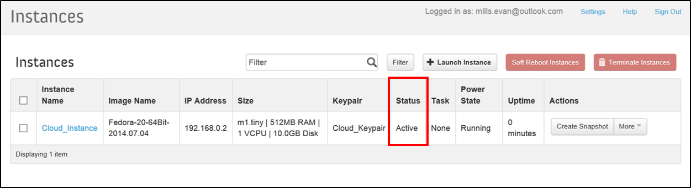

Launch an Instance from Image
"""""""""""""""""""""""""""""

**Images & Snapshots** contains the list of all available images and snapshots for the project. This includes pre-built images provided by Cloudlynx, public images shared by users of the Cloudlynx cloud and images created and uploaded to the current project (non-public).

To launch an instance directly from a pre-built image:

1. Click on **Images & Snapshots** sub-menu item under the **Manage Compute** section on the side bar.
2. Navigate using the buttons **Project**, **Cloudlynx images**, **Shared with Me** and **Public** to select an image to be used for launching an instance.

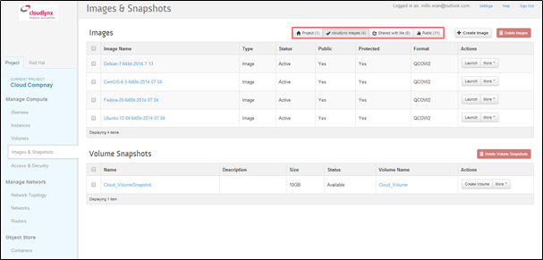
   
3. Click on the **Launch** button on the right of the image you want to start. The dialogue window will appear.
4. Follow the steps described in chapter 9.1 Launch an Instance from the Dashboard.

**Note:** The fields **Instance Boot Source** and **Image Name** are pre-populated with the chosen image information.

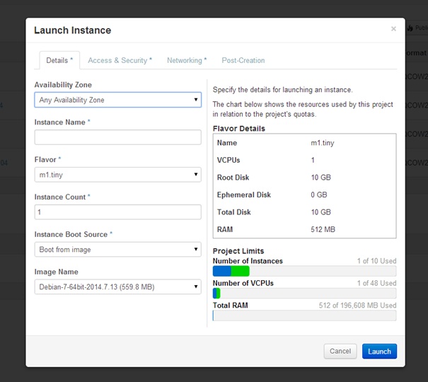
   
Launch an Instance from a Snapshot
""""""""""""""""""""""""""""""""""

Launching an instance from a snapshot requires an already existing snapshot. For information on how to create a snapshot see chapter :ref:`snapshot-instance`.

1. Click on the **Images & Snapshots** sub-menu item under the **Manage Compute** section on the side bar.
2. Make sure the button **Project** is active (top of page) so as to be able to see your own image snapshots.
3. Find the snapshot you want to use in the **Images** list (Type: Snapshot) and click on the **Launch** button on the very right.

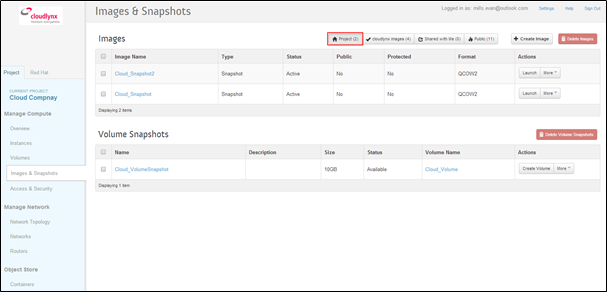
   
4. The **Launch Instance** pop-up window will appear.
5. Follow the steps described in chapter 9.1 Launch an Instance from the Dashboard on how to launch an instance.

**Note:** The fields **Instance Boot Source** and **Instance Snapshot** are pre-populated with the chosen Image information.

**Note:** The list **Volume Snapshots** contains snapshots that cannot be used as a boot source.

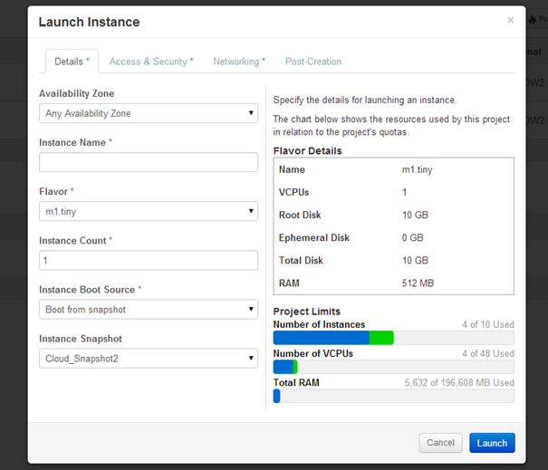
   
Launch an Instance from a Volume
""""""""""""""""""""""""""""""""

Launching an instance from a volume requires an already existing volume with an image on it. For information on how to create a volume with an image refer to chapter 14 Create a Volume.

1. Select the **Instances** sub-menu item under the **Manage Compute** section on the side bar.

   
2. Click on the **Launch Instance** button. The **Launch Instance** pop-up window is displayed.
3. In the drop-down menu under **Instance Boot Source** select **Boot from volume**.
4. Select the correct volume to be used as the boot source.
5. Follow the steps described in chapter :ref:`launch-instance-dashboard` from the Dashboard for information on how to launch an instance.

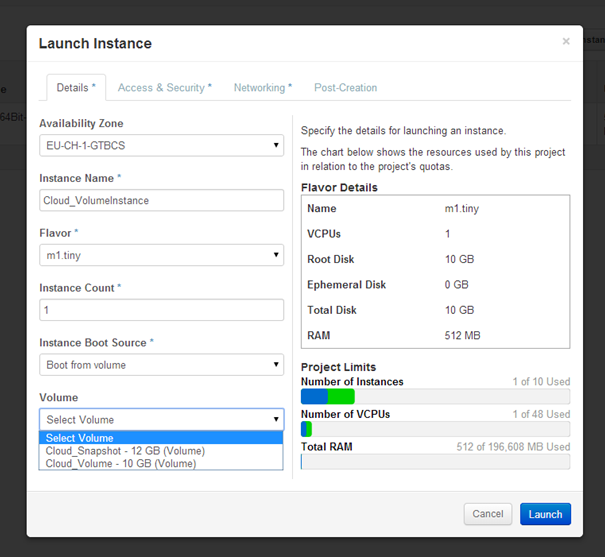
   
Launch an Instance Using CLI
^^^^^^^^^^^^^^^^^^^^^^^^^^^^

To launch an instance using the CLI, the OpenStack client needs to be installed and configured on the local Linux client (see chapter :ref:`cli`).

**Note:** All commands shown are for Linux based operating systems. This chapter will not cover Windows based operating systems

Gather Parameters to Launch an Instance
"""""""""""""""""""""""""""""""""""""""

To be able to create the launch command, several variables should be collected before using the commands below. Most commands show just a list of possible variables from where the one needed can be chosen from.

Minimum required variables to launch an instance:

1. An instance source (image, snapshot or volume that contains an image or snapshot).:

    $ nova image-list

2. The flavour size for the instance.::

    $ nova flavor-list

3. Access and security credentials
  * A keypair for your instance. For the keypair to be successfully injected, the image must contain the cloud-init package.:
  
    $ nova keypair-list

  * A security group that defines which incoming network traffic is forwarded to instances. Security groups hold a set of firewall policies, known as security group rules.:
  
    $ nova secgroup-list

4. The network which the instance will be connected to.:

    $ nova network-list

Additionally the following information is needed

1. A name for the instance
2. Account information to connect to the Cloudlynx environment

  * OS-username (Cloudlynx login name)
  * OS-password (Cloudlynx login password)
  * OS-tenant-name (project name as displayed in the Cloudlynx dashboard side bar)
  * OS-auth-url (The Identitiy (Keystone) API url can be found following the steps in chapter :ref:`cli`).)

**Note:** In this chapter the wording ‘OS’ in variables or parameters refers to ‘OpenStack’ (Cloudlynx) and not ‘Operating System’.

**Note:** Using the command line interface, an instance can be launched from an **image** or a **volume**, but not from a **snapshot**. 

Launch Instance via CLI Command
"""""""""""""""""""""""""""""""

1. To get an idea which options are possible, execute the nova boot command without any parameters::

    nova boot   [--flavor <flavor>] [--image <image>]
                [--image-with <key=value>] [--boot-volume <volume_id>]
                [--snapshot <snapshot_id>] [--num-instances <number>]
                [--meta <key=value>] [--file <dst-path=src-path>]
                [--key-name <key-name>] [--user-data <user-data>]
                [--availability-zone <availability-zone>]
                [--security-groups <security-groups>]
                [--block-device-mapping <dev-name=mapping>]
                [--block-device key1=value1[,key2=value2...]]
                [--swap <swap_size>]
                [--ephemeral size=<size>[,format=<format>]]
                [--hint <key=value>]
                [--nic <net-id=net-uuid,v4-fixed-ip=ip-addr,port-id=port-uuid>]
                [--config-drive <value>] [--poll]
                <name>

2. Compile all the parameters necessary and execute the nova boot command. See example command below::

  $ nova --os-username=user1 --os-tenant-name=”my tenant” --os-auth-url=https://api.preview.cloudlynx.ch/api/keystone/v2.0/ boot --flavor m1.tiny --image 55b1a2b7-75a2-49dc-a0e9-99fb17ac1b54 --key_name ssh_key1 --meta description=”my test instance” --nic net-id=82f3c9b1-945e-4674-8f84-21d713ad85c4 NameOfTheInstance

3. Nova prompts for your OS-password (Cloudlynx user log in). Provide the password.::

  OS Password: 

4. If the password is correct, the nova boot command will execute and launch the instance and the following overview of the started instance is shown in the terminal.::

    +--------------------------------------+--------------------------------------+
      | Property                               | Value                            |
    +--------------------------------------+--------------------------------------+
    | OS-EXT-STS:task_state                | scheduling                           |
    | image                                | Cirros Test                          |
    | OS-EXT-STS:vm_state                  | building                             |
    | OS-EXT-SRV-ATTR:instance_name        | instance-000045c5                    |
    | OS-SRV-USG:launched_at               | None                                 |
    | flavor                               | m1.tiny                              |
    | id                                   | 52b3ade2-285a-454d-a87e-f93af8bd59e8 |  
	| security_groups                      | [{u'name': u'default'}]              |
    | user_id                              | 49996ac695564577b18ecfac865f4488     |
    | OS-DCF:diskConfig                    | MANUAL                               |
    | accessIPv4                           |                                      |
    | accessIPv6                           |                                      |
    | progress                             | 0                                    |
    | OS-EXT-STS:power_state               | 0                                    |
    | OS-EXT-AZ:availability_zone          | nova                                 |
    | config_drive                         |                                      |
    | status                               | BUILD                                |
    | updated                              | 2014-09-04T11:57:55Z                 |
    | hostId                               |                                      |
    | OS-EXT-SRV-ATTR:host                 | None                                 |
    | OS-SRV-USG:terminated_at             | None                                 |
    | key_name                             | ssh_key1                             |
    | OS-EXT-SRV-ATTR:hypervisor_hostname  | None                                 |
    | name                                 | instance1                            |
    | adminPass                            | XXXXXXX                              |
    | tenant_id                            | 3e4608c9747348c79b887b19242ccf23     |
    | created                              | 2014-09-04T11:57:54Z                 |
    | os-extended-volumes:volumes_attached | []                                   |
    | metadata                             | {u'description': u'test instance'}   |
    +--------------------------------------+--------------------------------------+

5. To see the current status of the started instance, use the command below::

  $ nova -show 'name of your instance'
  
Launch an Instance using API 
^^^^^^^^^^^^^^^^^^^^^^^^^^^^

Launching instances from images and assigning metadata to instances is done through the compute API.

For more information on how to launch an instance using the compute API, see chapter 0. 

Launch an Instance Using Orchestration
^^^^^^^^^^^^^^^^^^^^^^^^^^^^^^^^^^^^^^

Orchestration allows the management of infrastructure resources for cloud applications including (among others) instance creation and autoscaling in the form of a scaling group in the Heat template (main project in the OpenStack orchestration programme).

For more detailed information on how to launch an instance using orchestration, see :ref:`orchestration`. 

