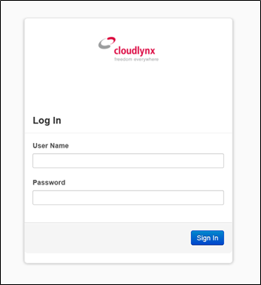
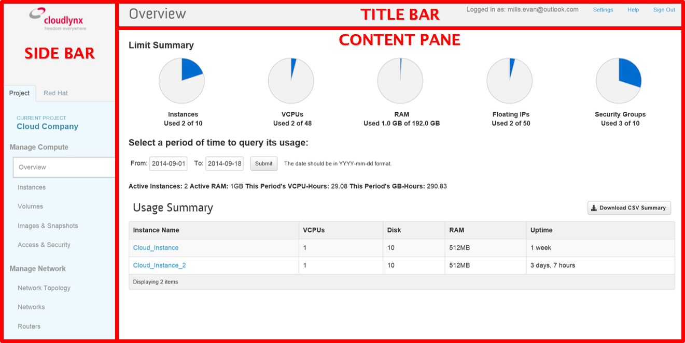
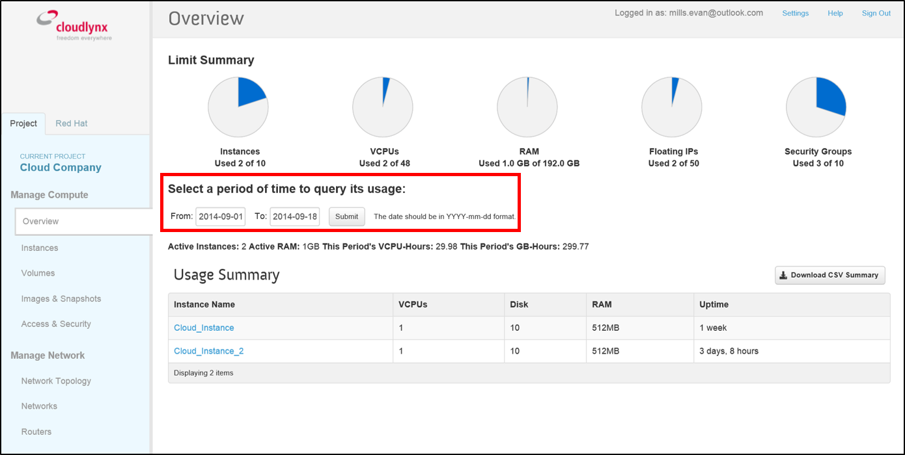
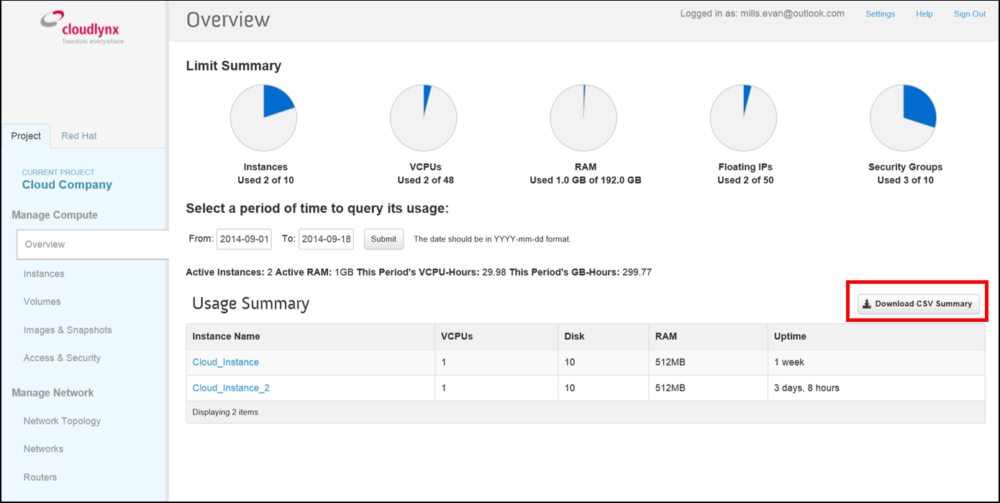

Getting Started
===============

Introduction
------------

Welcome to the Cloudlynx cloud! This document is designed to help cloud administrators and system operators get started with the cloud environment. It can also act as a reference for daily operations.

The document covers the following topics:

* Compute instance (how to set up, launch and manage instances)
* Storage options (Block and object storage)
* Introduction to APIs and CLI
* Introduction to orchestration (automate the cloud infrastructure)

Before using the Cloudlynx cloud environment, we recommend reading this document to familiarise yourself with the system.

Additional training courses and course material are available on the Cloudlynx website: https://www.cloudlynx.ch

**Note:** This document assumes you have an active Cloudlynx account.

Cloudlynx Dashboard
-------------------

The Cloudlynx dashboard serves as the starting point when accessing the Cloudlynx graphical user interface (GUI). It provides an overview of the current cloud resources being used, as well as listing the cloud services offered by Cloudlynx.

Log in to the Cloudlynx Dashboard
^^^^^^^^^^^^^^^^^^^^^^^^^^^^^^^^^

To log in to the Cloudlynx dashboard, use the link provided in the welcome email or use the login link on the Cloudlynx webpage. The login credentials are provided during the registration process.

   :alt Log In window

**Note:** The registration process is not covered in this document. For more information, please visit https://www.cloudlynx.ch/en/registration.

**Note:** In the case of a forgotten password, please go to the account management site https://preview.cloudlynx.ch/account.

Overview of the Cloudlynx Dashboard
^^^^^^^^^^^^^^^^^^^^^^^^^^^^^^^^^^^

After successfully logging in to the Cloudlynx dashboard, you will be directed to the **Overview** page.
The **Overview** page provides an overview of the cloud resources: applied limits, currently used cloud resources, as well as providing the possibility to query cloud usage from the past.

The Cloudlynx dashboard is split into 3 sections:

* The side bar (left part of the screen)
* The content pane (middle part of the screen)
* The title bar (top part of the screen)

   :alt Dashboard Overview

**Note:** Directions given in this document will use the definitions above.

The Side Bar
""""""""""""
The left section of the Cloudlynx dashboard is called the side bar. Here, you will find a list of the cloud services that Cloudlynx provides as well as your current project.

The side bar has the following menu structure:

**Manage Compute**

* Overview:	provides an overview of the current resource usage
* Instances: create, launch and manage instances
* Volumes: create, attach and manage persistent block storage
* Images & Snapshots: create, upload and manage images and snapshots
* Access & Security: configure security of and access to instances 

**Manage Network**

* Network Topology: provides a graphical overview of the network setup
* Networks: create and configure virtual networks, subnets, gateways, IP allocations
* Routers: create, configure and connect routers to virtual networks

**Object Store**

* Containers: create, upload and manage persistent object storage
	
**Orchestration**

* Stacks: execute automatic deployment of a whole cloud setup (including compute, block storage, object storage, network etc.)

**Note:** The Red Hat tab forwards you to the Red Hat Customer Portal. This feature should not be used, as it will be removed in future updates. A Red Hat account or subscription is required for accessing this section.

The Content Pane
""""""""""""""""

This section displays the main content. The shown content will vary depending on the topic selected from the side bar.
On the **Overview** page you are able to query current and past cloud usage, as well as export the results. This can be done by selecting a **From:** and **To:** date and pressing **Submit**. The results are then displayed.

**Note:** The Date format needs to be YYYY-MM-DD.

   :alt Select a period of time to query its usage

A usage summary report can be exported into CSV format. Click on the **Download CSV Summary** button to generate the file.

   :alt Download CSV Summary
   
The Title Bar
"""""""""""""

The title bar can be found at the top of the page and is always displayed independent of any selected topic.

* Logged in as: indicates which user account is currently logged in 
* Settings: change language, time zone, items per page shown and password
* Help: opens the official documentation of OpenStack
* Sign Out: log out of the current session

Change Password
"""""""""""""""
A password change should not be done via the **Settings** link in the title bar. Instead please go to the account management site https://preview.cloudlynx.ch/account/admin/. Log in with your credentials, click on the user icon in the upper right hand corner and select **Change Password**. 

   :alt Change Password

