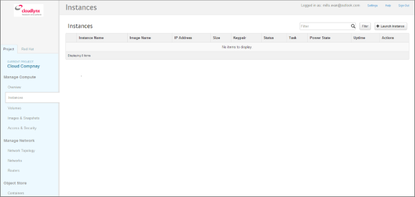
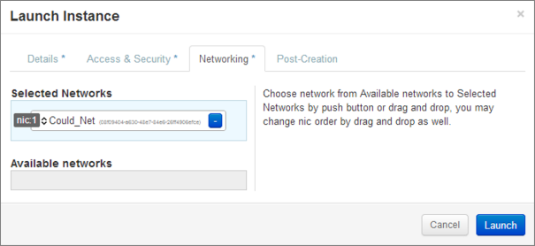
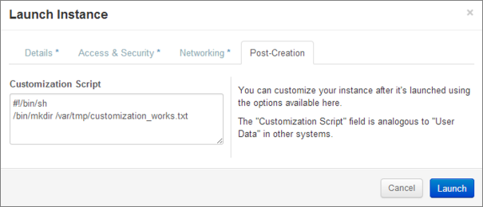
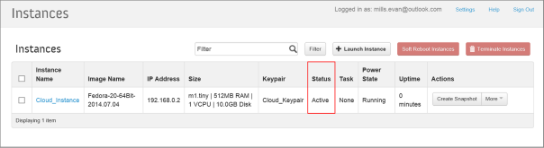

Launch an Instance
==================

**General Prerequisites**:

* Log-in to the Cloudlynx Dashboard
* Configure the network the Instance will be attached to
* Find out which is the boot media you are going to use
	* Pre-defined image from Cloudlynx
	* Upload your own image
	* Start an Instance from an already existing snapshot
	* Start an Instance from an already existing volume
* Find out the requirements for the Instance (RAM, CPU, Boot Disk size)

Launch an Instance from the Dashboard
-------------------------------------

**To launch an instance via the Cloudlynx dashboard**:

1. Select the **Instances** sub-menu item under the **Manage Compute** section on the side bar.

2. Click on the **Launch Instance** button on the top right. The **Launch Instance** pop-up window is displayed.

.. image:: _static/launchaninstance/fig2.png
      :alt: Launch Instance Details

3. Select an availability zone for the instance from the dropdown list. This defines where the instance will be physically located.
4. Fill out the **Instance Name** field to give the instance a unique name for easy identification.
5. Select a flavour for the instance. Flavours are predefined and determine the compute resources available. For the selected flavour, the resources are displayed in the **Flavour Details** section on the right.
6. To launch multiple instances, enter a value greater than one in the **Instance Count** field.
7. Select the **Instance Boot Source** from the dropdown list and fill out the additional fields depending on the boot source chosen.

.. image:: _static/launchaninstance/fig3.png
      :alt: Launch Instance Instance Boot Source

**The Instance Boot Sources are**:

*  **Boot from image** – A new field for **Image Name** displays. Select an image from the list.

*  **Boot from snapshot** – A new field for **Instance Snapshot** displays. Select a snapshot from the list.

*  **Boot from volume** – A new field for **Volume** displays. Select a volume from the list.

*  **Boot from image (creates a new volume)** – Boot from an image and create a volume by entering the device size and device name for your volume. Select the **Delete on Terminate** option to delete the volume on terminating the instance.

*  **Boot from volume snapshot (creates a new volume)** - boot from a volume snapshot and create a new volume by choosing **Volume Snapshot** from the list and adding a **Device Name** for your volume. Click the **Delete on Terminate** option to delete the volume on terminating the instance.

8. Click on the **Access & Security** tab.
9. Select your **Keypair** from the dropdown list.
10. Select the your **Security Group**.

.. image:: _static/launchaninstance/fig4.png
      :alt: Launch Instance Access & Security

11. Click on the **Networking** tab.
12. Select your network from the **Available networks** list. Either by clicking on the blue **+** button for the relevant network or by dragging and dropping the network from the **Available networks** to the **Selected Networks** field.

.. note::
   Several networks can be added to the same instance.
 
13. The **Post-Creation** tab allows to use scripts (for example Bash) that can be run after launching an instance or instances.

14. Click on the **Launch** button to launch the instance.
15. To check the status of the instance, select the **Instances** sub-menu item under the **Manage Compute** section.
16. Once the instance is up and running, the status will change to **Active**.

