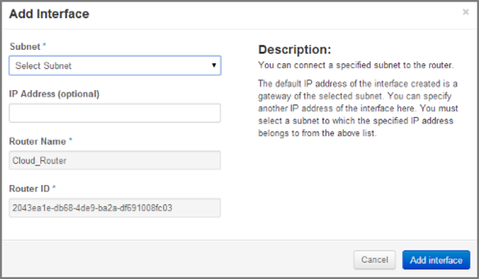

Network Setup
=============

Create a Network and a Subnet
-----------------------------

1. Select the **Networks** sub-menu item under the **Manage Network** section on the side bar.
2. Click on the **Create Network** button.

3. The dialogue window which appears consists of the tabs **Network**, **Subnet* ** and **Subnet Detail**.

.. image:: _static/networksetup/pic2.png
      :alt: Create Network – Network tab
	  
4. Specify a name to identify the network in the **Network Name** field.
5. **Admin State** field – checked by default. If check box is empty, it means the network is down and will not forward packets.
6. Click on the **Subnet** tab.
7. Specify a name for the subnet.
8. Specify the IP address for the subnet (e.g. 192.168.0.0/24).
9. Select **IP version**: IPv4 or IPv6 (IPv6 currently not applicable).
10. Specify a **Gateway IP** address. This parameter is optional. If this field is left blank, the system will automatically take the first address of the defined subnet IP range (e.g. 192.168.0.1).
11. Go to the **Subnet Detail** tab in order to define additional attributes for the subnet (all optional).
12. Mark the **Enable DHCP** checkbox to enable DHCP.
13. Click on the **Create** button in the dialogue window.
14. The network is created.
15. The network now appears in the list of networks under **Manage Network -> Networks**.

.. note::
	A subnet must be specified to be able to launch an instance.

.. note::
	A subnet represents an IP address block that can be used to assign IP addresses to virtual instances. Each subnet must have a Classless Inter-Domain Routing (CIDR) address and must be associated to a network. IP addresses can be either selected from the whole subnet CIDR or from allocation pools that can be specified by the user.

.. note::
	A subnet can also optionally have a gateway, a list of DNS name servers, and host routes. This information is pushed to instances whose interfaces are associated with the subnet. 
	
Router Setup
============

A router is needed to establish a connection between subnets or to connect a subnet to the public network so that the instances can be reached over the internet.

Create a Router
---------------

1.	Select the **Routers** tab on the side bar under the **Manage Network** section.
2.	Click on the **Create Router** button. 
3.	In the **Create Router** dialogue box, specify a name for the router.
4.	Click on the **Create Router** button. The new router is now displayed in the **Routers** tab.

.. image:: _static/networksetup/pic3.png
      :alt: Create Router
	  
Set a Gateway
-------------

1.	Select the **Routers** tab on the side bar under the **Manage Network** section.
2.	Click on the **Set Gateway** button for the router you want to set a gateway for.
3.	In the **External Network** field, specify the network to which the router will connect (this is normally the public network, which is a connection to the Internet).
4.	Click on the **Set Gateway** button.

.. image:: _static/networksetup/pic4.png
      :alt: Set Gateway
	  
Connect a Private Network to a Router
-------------------------------------

1.	Select the **Routers** tab on the side bar under the **Manage Network** section. 
2.	Click on the name of the router.
3.	On the **Router Details** page, click on the **Add Interface** button.
4.	In the **Add Interface** dialogue box, select a subnet from the **Subnet** dropdown list.
5.	Enter the router interface **IP address** for the selected subnet. 
6.	Click on the **Add Interface** button to finish.

.. note::
	If the IP address value is not set, the first host IP address in the subnet is used by default.
	

	  
Network Topology
================

The **Network Topology** page represents a graphical overview of the created networks.
The following buttons are available at the top of the **Network Topology** page:

- **Launch Instance**
- **Create Network**
- **Create Router**

There are also two buttons called **Small** and **Normal**. Those will change the view of the network topology, to either give you more space if you have a lot of networks (**Small**) or show you more details (**Normal**) including IP addresses and names.

Hover over **Instance** and **Router** icons to see the details and also to perform certain actions, for example:

- terminate an instance
- view instance details
- open the console
- delete a router
- delete an interface

By clicking on the network name the **Network Detail** page will be opened, showing a network overview, related subnets and ports.

.. image:: _static/networksetup/pic6.png
      :alt: Network Topology
	  
View Network Detail
-------------------

1. Select **Network Topology** on the side bar under the **Manage Network** section. 
2. Click on the name of the network you want to know more about.
3. The **Network Overview** page of the selected network is displayed.

From the **Network Overview** page it is possible to create, edit or delete a subnet, as well as to edit ports.

	  
