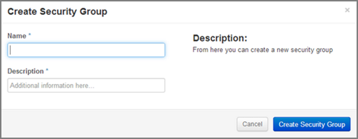
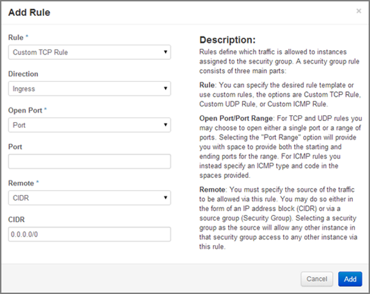
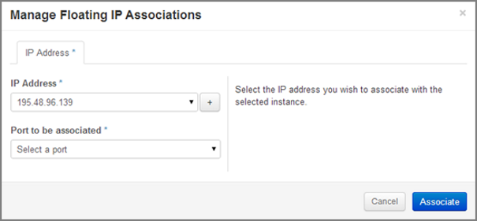

Security
========

How to Create a Security Group
------------------------------

1. Click on the **Access & Security** sub-menu item under the **Manage Compute** section.

.. image:: _static/security/pic1.png
      :alt: Access & Security - Security Groups

2. Click on the **Create Security Group** button.
3. The **Create Security Group** pop-up window is displayed.

4. Specify a name for the security group under **Name**.
5. Add a description for the security group under **Description**.
6. Click on the **Create Security Group** button.

.. image:: _static/security/pic3.png
      :alt: Security Groups list

7. The new security group appears in the list under **Security Groups**.
	  
  
Security Group Rules	  
--------------------

Modify the rules in a security group to allow access to instances through different ports and protocols. 

**The following parameters for rules must be specified**:

- **Destination Port On Instances** – Define a port range. To open a single port, enter the same value twice. The Internet Control Message Protocol (ICMP) does not support ports; enter values to define the codes and types of ICMP traffic to be allowed instead. 
- **Source of Traffic** – The source can be defined either as an IP address, an IP address range, or as another security group in the cloud.

.. note::
	Rules are automatically enforced for that security group as soon as you create or modify them. This takes effect on the instances that have the security group assigned to it.  

.. image:: _static/security/pic4.png
      :alt: Edit Security Group Rules

1. Click on the **Access & Security** sub-menu item under the **Manage Compute** section.
2. In the **Security Group** tab, click the **Edit Rules** button of your security group.

3. Click on the **Add Rule** button.
4. The **Add Rule** pop-up window is displayed.

- **Rule** – Select the desired rule template or use custom rules from the **Rule** dropdown list. 
- **Direction** – Select the direction from the dropdown list. 
- **Open Port** – Define the port or ports to which the rule will apply using the **Open Port** field. 
		**Port** – Define a specific port in the **Port** field.
		**Port Range** – Define the port range using the **From Port – To Port** fields.
- **Remote** – Specify the source of the traffic to be allowed via this rule.
		**CIDR** – Define the source of the traffic in the form of an IP address block.
		**Security Group** – Selecting a security group as the source will allow any other instance in that security group access to any other instance with the source of traffic defined via security group.

5. Click on the **Add** button to add the new rule to the security group.
6. You need to add a rule to allow Ingress to port 22 (SSH) – use the Custom TCP rule
7. Also add an ICMP rule – also Ingress from anywhere
8. The rule is successfully added to a security group. 
	  
.. image:: _static/security/pic7.png
      :alt: Security Group Rules – successfully added new rule	  
	  
.. note::
	Once a rule is created, it cannot be edited later. If a rules needs to be changed, it needs to be deleted and created as a new rule with new parameters.

Floating IP's
-------------

Each launched instance has a private IP address and can also have a public (floating) IP address. The private IP address is used for communication between instances, and the public address is used for communication with networks outside the cloud, including the Internet.

**To add a new floating IP to your project, proceed as follows**:

1. Click on the **Access & Security** sub-menu item under the **Manage Compute** section.
2. Click on the **Floating IPs** tab.

	  
3. Click on the **Allocate IP to Project** button.
4. An **Allocate Floating IP** pop-up window is displayed.

.. image:: _static/security/pic9.png
      :alt: Allocate Floating IP
	  
5. Click on the **Allocate IP** button to add a new floating IP to the floating IP pool.

	  
6. A new floating IP is available in the **Floating IPs** list under **Manage Compute – Access & Security**.
7. Click on the **Access & Security** sub-menu item under the **Manage Compute** section. 
8. Click on the **Floating IPs** tab. 
9. In the **Floating IPs** list click on the **Associate** button. The **Manage Floating IP Associations** pop-up window is displayed.

	  
10. The floating IP chosen is automatically filled into the **IP Address** field. 

- A new IP address can be added by clicking the **+** button. This option will add a new Floating IP to your floating IP pool.
- Another IP address can be selected also by opening the dropdown menu and selecting an alternative IP address from the pool of available IP addresses to your project.

11. Click on a port in the **Port to be associated** dropdown menu to associate it with the floating IP. The list shows all the instances with their fixed IP addresses. 

.. image:: _static/security/pic12.png
      :alt: Manage Floating IP Association – select a port (instance)
	  
12. Click on the **Associate** button. 
13. The IP address will be associated to the instance.
14. This is the IP address that will be used to access the instance from the internet.

