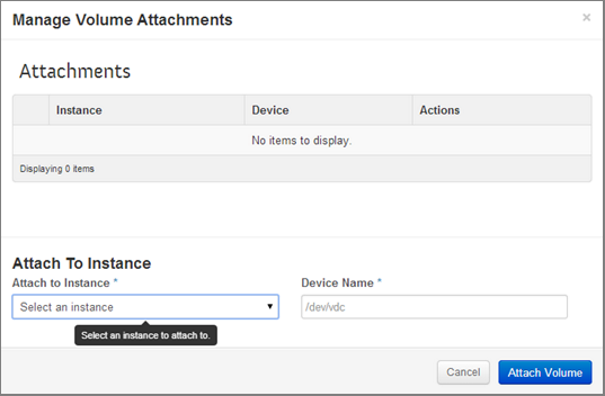

Data Storage
============

Block Storage
-------------

Create a Volume
^^^^^^^^^^^^^^^

1. Click on the **Volumes** tab under **Manage Compute** in the side bar. In the table on the right you see all the volumes created so far (if you have not created a volume yet, it will be empty).

2. Click on the **Create Volume** button in the top right corner.

3. The **Create Volume** pop-up appears.

4. **Volume Name** – Add a suitable name for the volume in the box provided.

5. **Description** – Optionally, add a description for the volume.

6. **Type** – Leave the **Type** box blank (currently not supported).

7. **Size (GB)** – Specify the number of GB for the volume. Check the Volume Limits on the right side for the available amount of GB (**Total Gigabytes** bar).

8. **Volume Source** – Select the volume source. 

	a. Selecting **No source, empty volume creates an empty volume** (like an unformatted physical hard drive).
	
9. Click the **Create Volume** button. 

10. You can see the volume you created in the **Volumes** table list.

.. note::
   The **Volume Source** options will not display the snapshot option if there are no existing snapshots in your project.

.. note::
   If you choose **No Source, empty volume** it does not contain a file system or a partition table.

Attach a Volume to an Instance
------------------------------

Attach a Volume to an Instance in the Cloudlynx Dashboard
^^^^^^^^^^^^^^^^^^^^^^^^^^^^^^^^^^^^^^^^^^^^^^^^^^^^^^^^^

1. Click **Volumes** under **Manage Compute** on the side bar.

2. Find the volume you want to attach in the table on the right.

3. Click the **Edit Attachments** button under Actions on the right hand side of the table.

4. A window appears (**Manage Volume Attachments**). 

5. From the **Attach to Instance** dropdown menu, select the instance to which the volume should be attached. An instance needs to be launched first before you can attach a volume. If there is no instance, the list will be empty.

6. Under **Device Name** enter the name of the device.

7. Click **Attach Volume**.

8. In the **Volumes** table you can see the instance to which the volume has been attached.

.. note::
   Several volumes can be attached to one instance. In Linux the device name should be in alphabetical order, e.g. the first volume is /dev/vdb, the second is /dev/vdc and so on.

Attach a Volume to a Linux Instance
^^^^^^^^^^^^^^^^^^^^^^^^^^^^^^^^^^^

Attaching a volume to a Linux instance involves three steps: 

1. Attach a volume to the instance in the Cloudlynx dashboard

2. Initialise the volume

3. Mount the volume in the instance

Initialize a Volume Attached in a Linux Instance
""""""""""""""""""""""""""""""""""""""""""""""""

.. caution::
   Any data that might be on the volume will be lost when initialising the volume. This step should therefore only be performed if the volume is empty, i.e. the first time a volume is attached to an instance.

1. Connect to the instance using SSH

2. List all attached block storage devices:

	$ lsblk

3. Find the name of the attached block storage (e.g. /dev/vdc).

4. Create a file system on the device by giving in the following command (where <device> is the name of the attached block storage, e.g. /dev/vdc):

	$ sudo mkfs.ext4 <device>

.. note::
   The name of the attached block storage can be changed by the OS of the instance if the device name is already taken.

   
Mount a Volume on a Linux Instance 
""""""""""""""""""""""""""""""""""

1. Create a directory under /media where the volume should be mounted by executing the following command:

	$ sudo mkdir –p /media/<volume name>

2. Mount the volume by executing the following command:

	$ sudo mount <device> /media/<volume name>

Object Storage
--------------

Create a Container
^^^^^^^^^^^^^^^^^^

1. Select the **Containers** sub-menu item under the **Object Store** section on the side bar.

2. In the table on the right hand side, all containers created so far are shown (if a container has not been created yet, it will be empty).

3. Click on the **Create Container** button in the table. A **Create Container** pop-up window is displayed.

.. image:: _static/storage/fig5.png
                  :alt: Containers – Create Container  

4. Fill out the **Container Name** field to give the instance a unique name with which it can be identified. 

.. note::
   The names are case sensitive.

5. Click on the **Create Container** button.
6. The object store container created will be visible in the **Containers** table list.

.. image:: _static/storage/fig6.png
                  :alt: Containers Successfully Created Container  

				  

Store Files in a Container
--------------------------

1. Select the **Containers** sub-menu item under the **Object Store** section on the side bar.

2. From the list of **Containers**, select the container where to upload the file.

3. Click on the **Upload Object** button on the right (If the button is not visible, click on the name of the container). The **Upload Object to Container** pop-up window is displayed.

4. Fill out the **Object Name** field to give the instance a unique name to be identified with. This will be the name of the file under which it will be stored in the container. 

5. Select a file to be uploaded.

.. image:: _static/storage/fig8.png
                  :alt: Upload Object to Container   

6. Click on the **Upload Object** button to finalise the upload.

7. The uploaded file will be visible in the table on the left hand side of the **Containers** page.

.. image:: _static/storage/fig9.png
                  :alt: Containers – Successfully Upload an Object   

Retrieve Files from a Container
^^^^^^^^^^^^^^^^^^^^^^^^^^^^^^^

1. Select the Containers sub-menu item under the Object Store section on the side bar.

2. From the list of Containers, select the container from where to retrieve a file.

3. Click on the **Download** button to the right of the file to be downloaded.

4. The download starts, possibly after asking where to save the file.

Delete One File from a Container
^^^^^^^^^^^^^^^^^^^^^^^^^^^^^^^^

1. Select the **Containers** sub-menu item under the **Object Store** section on the side bar.

2. From the list of **Containers**, select the container from where to delete the file.

3. Click on the **Delete Object** option from the **More** dropdown menu button to the right of the file to be deleted. The **Confirm Delete Object** pop-up window is displayed.

4. Click on the **Delete Object** button to confirm the deletion. 

.. note::
   This action cannot be undone!

.. image:: _static/storage/fig12.png
                  :alt: Confirm Delete Object   

 